# Enter Serverless Functions Journey with Quarkus

This hands-on lab showcases how quickly developers can create cloud-native microservice project using Quarkus. Then, the application can be deployed to a function to AWS Lambda and OpenShift Serverless with JVM and Native mode.

# Pre-requisites

Before you get started with the hands-on labs, if you already haven't user accounts in the sandbox and AWS, you might need to sign in two cloud services for function deployments such as OpenShift(Kubernetes) and AWS Lambda as below:

* Sign up the [Developer Sandbox for Red Hat OpenShift](https://developers.redhat.com/developer-sandbox) to deploy Quarkus serverless functions to Kubernetes/OpenShift cluster. Click on `Get Started in the Sandbox`. You will need to create a new user account using your email address then your sandbox will stand up in 5 minutes.

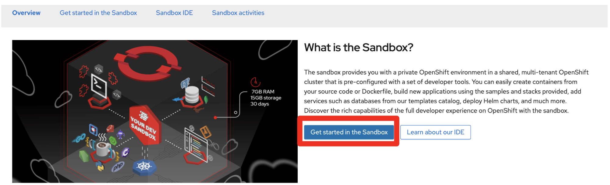

* Sing up [Amazon Web Services](https://aws.amazon.com/marketplace/management/signin). You might need to add your personal credit card information which won't charge for the function deployment during the lab. Because the function will be deleted at the end of the workshop.

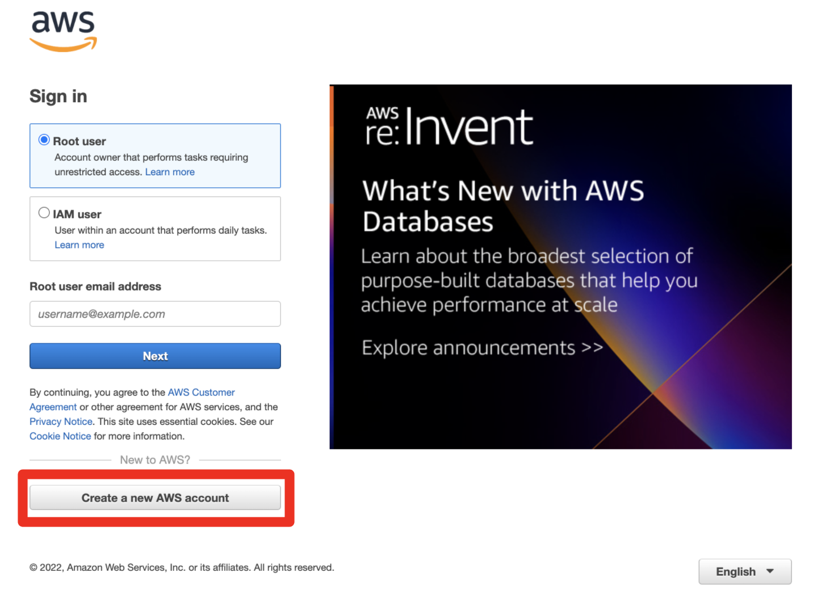

* [JDK 11+](https://openjdk.java.net/install/) installed with `JAVA_HOME` configured appropriately

* [Apache Maven](https://maven.apache.org/download.cgi) 3.8.1+

* Optionally the [Quarkus CLI](https://quarkus.io/guides/cli-tooling) if you want to use it

* Optionally the [HTTPie](https://httpie.io/) if you want to use it


# Table of Contents
1. [Generate a new Quarkus project](#GenerateNewQuarkusProject)
2. [Deploy to AWS Lambda with HTTP API](#DeployAWS)
3. [Optimize the function and make it portable using Quarkus Funqy](#OptimizeFunction)
4. [Deploy the function to Red Hat OpenShift Serverless](#DeployFunctiontoOCP)
5. [Generate a new function project using Kn func CLI](#GenerateNewFuncProject)
6. [Additional Resources](#AdditionalResources)

## Generate a new Quarkus project <a name="GenerateNewQuarkusProject"></a>

Use `Quarkus CLI` to scaffold a new Quarkus project based on Maven. Run the following command locally in the Terminal:

**Note**: You can use [Maven](https://maven.apache.org/download.cgi) or [Gradle](https://gradle.org/install/) or Quarks tools in IDE instead of **Quarkus CLI**.

```shell
quarkus create app enter-serverless-function

```

The output looks like:

```shell
Creating an app (default project type, see --help).
-----------

applying codestarts...
📚  java
🔨  maven
📦  quarkus
📝  config-properties
🔧  dockerfiles
🔧  maven-wrapper
🚀  resteasy-codestart

-----------
[SUCCESS] ✅  quarkus project has been successfully generated in:
--> /YOUR_WORKING_DIR/enter-serverless-function
-----------
Navigate into this directory and get started: quarkus dev
```

### Test the application locally

First thing first! Run the Quarkus Dev Mode using the following Quarkus CLI:

```shell
cd enter-serverless-function
quarkus dev
```

The output looks like:

```shell
Listening for transport dt_socket at address: 5005
__  ____  __  _____   ___  __ ____  ______ 
 --/ __ \/ / / / _ | / _ \/ //_/ / / / __/ 
 -/ /_/ / /_/ / __ |/ , _/ ,< / /_/ /\ \   
--\___\_\____/_/ |_/_/|_/_/|_|\____/___/   
INFO  [io.quarkus] (Quarkus Main Thread) enter-serverless-function 1.0.0-SNAPSHOT on JVM (powered by Quarkus xx.xx.xx) started in 1.746s. Listening on: http://localhost:8080
INFO  [io.quarkus] (Quarkus Main Thread) Profile dev activated. Live Coding activated.
INFO  [io.quarkus] (Quarkus Main Thread) Installed features: [cdi, resteasy, smallrye-context-propagation]

--
Tests paused
Press [r] to resume testing, [o] Toggle test output, [h] for more options>
```

Press `r` to start the _continuous testing_ then press `d` to open a _DEV UI_. It will open a new web browser then access to DEV UI (http://localhost:8080/q/dev/):

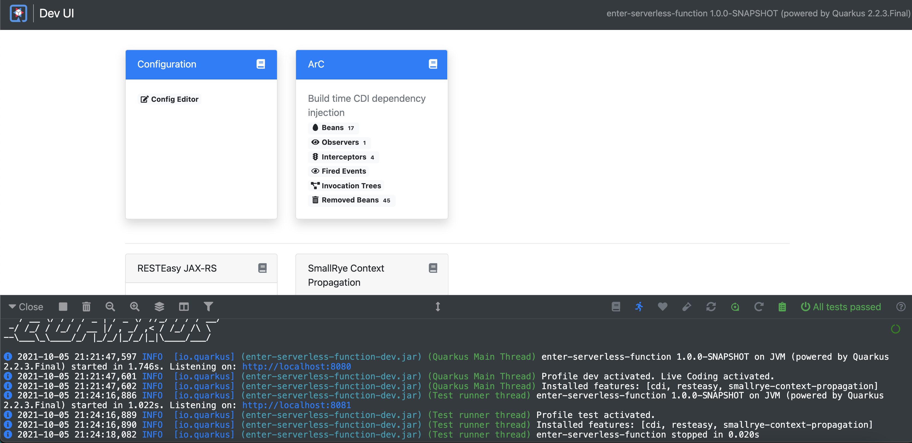

Verify the RESTful API if it works well. For example, use [HTTPie](https://httpie.io/) to invoke the endpoint:

```shell
http :8080/hello
```

The output should be:

```shell
HTTP/1.1 200 OK
Content-Length: 14
Content-Type: text/plain;charset=UTF-8

Hello RESTEasy
```

You can also use `curl` command to access the endpoint:

```shell
curl localhost:8080/hello
```

Keep *running* your Quarkus dev mode!! 

## Deploy to AWS Lambda with HTTP API  <a name="DeployAWS"></a>

To deploy this application to AWS Lambda with HTTP API, add a new Quarkus extension(_quarkus-amazon-lambda-http_) using Quarkus CLI:

```shell
quarkus ext add quarkus-amazon-lambda-http
```

The output should be:

```
[SUCCESS] ✅  Extension io.quarkus:quarkus-amazon-lambda-http has been installed
```

You can also search what kinds of extensions are available to install on the working project:

```shell
quarkus ext --installable -s aws
```

The output looks like:

```
Listing extensions (default action, see --help).
Current Quarkus extensions installable: 

...                      
camel-quarkus-aws2-eventbridge                    
camel-quarkus-aws2-iam                                                    
camel-quarkus-aws2-msk                            
...                 
camel-quarkus-aws2-translate                      
quarkus-amazon-alexa                              
...                         
quarkus-amazon-lambda                             
quarkus-amazon-lambda-rest    
quarkus-amazon-lambda-xray                                           
quarkus-amazon-s3                                 
...                     
quarkus-amazon-ssm                                
quarkus-funqy-amazon-lambda                       
quarkus-hibernate-search-orm-elasticsearch-aws    
...
```

Before we deploy, let's add a new method and class to expose a new function on AWS Lambda.

Create a new `GreetingService.java` file in _src/main/java/org/acme/_. Then copy the following code:

```java
package org.acme;

import javax.enterprise.context.ApplicationScoped;

@ApplicationScoped
public class GreetingService {

    public String greeting(String name) {
        return "Enter Serverless Functions with Quarkus, " + name;
    }

}
```

Update `GreetingResource.java` file in _src/main/java/org/acme/_ to inject a CDI bean as well as modifying the return string in _hello_ method:

```java
package org.acme;

import javax.inject.Inject;
import javax.ws.rs.GET;
import javax.ws.rs.Path;
import javax.ws.rs.Produces;
import javax.ws.rs.core.MediaType;

@Path("/hello")
public class GreetingResource {

    @Inject
    GreetingService greetingService;

    @GET
    @Produces(MediaType.TEXT_PLAIN)
    @Path("/greeting/{name}")
    public String greeting(String name) {
        return greetingService.greeting(name);
    }

    @GET
    @Produces(MediaType.TEXT_PLAIN)
    public String hello() {
        return "Hello Serverless";
    }
}
```

Verify both a new endpoint(_/hello/greeting/{name}_) and an existing one(_/hello_) using HTTPie:

```shell
http :8080/hello
```

The output looks like:

```shell
HTTP/1.1 200 OK
Content-Length: 16
Content-Type: text/plain;charset=UTF-8

Hello Serverless
```

Access another REST API:

```shell
http :8080/hello/greeting/daniel
```

The output looks like:

```shell
HTTP/1.1 200 OK
Content-Length: 47
Content-Type: text/plain;charset=UTF-8

Enter Serverless Functions with Quarkus, daniel
```

**Note**: You don’t need to stop and re-run the serverless application because Quarkus will reload the changes automatically via the Live Coding feature.

To mirror the AWS Lambda environment as closely as possible in a dev environment, the Quarkus Amazon Lambda extension boots up a mock AWS Lambda event server in Quarkus Dev and Test mode. This mock event server simulates a true AWS Lambda environment.

While running in Quarkus Dev Mode, you can feed events to it by doing an HTTP POST to http://localhost:8080. The mock event server will receive the events and your lambda will be invoked. You can perform live coding on your lambda and changes will automatically be recompiled and available the next invocation you make.

Update the test case along with the modified __hello__ function. Open the `GreetingResourceTest.java` file in __src/test/java/org/acme__ directory and replace `testHelloEndpoint()` method with the following code:

```java
    @Test
    public void testHelloEndpoint() {
        given()
          .when().get("/hello")
          .then()
             .statusCode(200)
             .body(is("Hello Serverless"));
    }
```

Save the file then go back to the terminal where Quarkus Dev mode is running. Press `r` in the terminal.

Then, you will see the test case passed as below:

```shell
--
All 1 test is passing (0 skipped), 1 test was run in 3541ms. Tests completed at 09:09:41.
Press [r] to re-run, [o] Toggle test output, [h] for more options>
```

Stop the Dev Mode using `CTRL-C`! Package the application using the following Quarkus CLI:

```shell
quarkus build --no-tests
```

or Use maven package command as below:

```shell
./mvnw clean package
```

The output will end with `BUILD SUCCESS`.

Inspect generated files in the _target_ directory:

* **function.zip** - lambda deployment file
* **bootstrap-example.sh** - example bootstrap script for native deployments
* **sam.jvm.yaml** - (optional) for use with sam cli and local testing
* **sam.native.yaml** - (optional) for use with sam cli and native local testing

**Note**: If you have already tested the function using live coding with Quarkus Dev mode, you can skip the function simulation locally. Then jump into the deployment step.

To simulate the function locally using [SAM CLI](https://docs.aws.amazon.com/serverless-application-model/latest/developerguide/serverless-sam-cli-install.html). The AWS SAM command line interface (CLI) requires you to set AWS credentials so that it can make calls to AWS services on your behalf. Find more information how to set up AWS credentials for SAM CLI [here](https://docs.aws.amazon.com/serverless-application-model/latest/developerguide/serverless-getting-started-set-up-credentials.html).

**NOTE**: You need to run a container runtime(e.g. [Docker](https://www.docker.com/products/docker-desktop)) to run the SAM emulator.

```shell
sam local start-api -t target/sam.jvm.yaml
```

Output should look like:

```shell
Mounting EnterServerlessFunctions at http://127.0.0.1:3000$default [X-AMAZON-APIGATEWAY-ANY-METHOD]
You can now browse to the above endpoints to invoke your functions. You do not need to restart/reload SAM CLI while working on your functions, changes will be reflected instantly/automatically. You only need to restart SAM CLI if you update your AWS SAM template
2021-10-05 22:48:29  * Running on http://127.0.0.1:3000/ (Press CTRL+C to quit)
```

Then, invoke the endpoint like in another terminal:

 * HTTPie:

```shell
http http://127.0.0.1:3000/hello/greeting/awslocal
```

 * Curl:

```shell
curl http://127.0.0.1:3000/hello
```

When you go back to the terminal where the sam local command is running, you will see that the Quarkus application gets started. It takes a few seconds to complete getting ready in Quarkus runtime.

Then, the output should look like:

```shell
HTTP/1.0 200 OK
Content-Length: 44
Content-Type: text/plain;charset=UTF-8
Date: Wed, 06 Oct 2021 02:49:22 GMT
Server: Werkzeug/1.0.1 Python/3.8.11

Enter Serverless Functions with Quarkus, awslocal
```

Stop the local testing by `CTRL-C`!

**Note**: You can also use the live coding feature for Lambda functions development locally. Find more information [here](https://quarkus.io/guides/amazon-lambda#live-coding-and-unitintegration-testing)

If you haven't already configured AWS credential locally (e.g., **~/.aws/credentials**) yet, run the following aws command line:

```shell
aws configure
```

Find more information about [Configuration and credential file settings](https://docs.aws.amazon.com/cli/latest/userguide/cli-configure-files.html).

Deploy the function to AWS Lambda using SAM CLI:

```shell
sam deploy -t target/sam.jvm.yaml -g
```

Input the configuration for the SAM Deploy with your preferences(e.g., stack name == `quarkus-function`). For example,

```shell
Configuring SAM deploy
======================

	Looking for config file [samconfig.toml] :  Not found

	Setting default arguments for 'sam deploy'
	=========================================
	Stack Name [sam-app]: quarkus-function
	AWS Region [us-east-1]: 
	#Shows you resources changes to be deployed and require a 'Y' to initiate deploy
	Confirm changes before deploy [y/N]: y
	#SAM needs permission to be able to create roles to connect to the resources in your template
	Allow SAM CLI IAM role creation [Y/n]: y
	#Preserves the state of previously provisioned resources when an operation fails
	Disable rollback [y/N]: n
	EnterServerlessFunction may not have authorization defined, Is this okay? [y/N]: y
	Save arguments to configuration file [Y/n]: y
	SAM configuration file [samconfig.toml]: 
	SAM configuration environment [default]:
...

```

Then, you might need to confirm your configurations as below:

```shell
CloudFormation stack changeset
-------------------------------------------------------------------------------------------------------------------------------------
Operation                         LogicalResourceId                 ResourceType                      Replacement                     
-------------------------------------------------------------------------------------------------------------------------------------
+ Add                             EnterServerlessFunctionsHttpApi   AWS::Lambda::Permission           N/A                             
                                  EventPermission                                                                                     
+ Add                             EnterServerlessFunctionsRole      AWS::IAM::Role                    N/A                             
+ Add                             EnterServerlessFunctions          AWS::Lambda::Function             N/A                             
+ Add                             ServerlessHttpApiApiGatewayDefa   AWS::ApiGatewayV2::Stage          N/A                             
                                  ultStage                                                                                            
+ Add                             ServerlessHttpApi                 AWS::ApiGatewayV2::Api            N/A                             
-------------------------------------------------------------------------------------------------------------------------------------

Changeset created successfully. arn:aws:cloudformation:us-east-1:716861016243:changeSet/samcli-deploy1633488868/1e632117-3395-4b76-8037-bc6529ace78d


Previewing CloudFormation changeset before deployment
======================================================
Deploy this changeset? [y/N]: 
```

Press `y` then you will receive the outputs by CloudFormation in a few minutes. It should look like:

```shell
CloudFormation events from changeset
-------------------------------------------------------------------------------------------------------------------------------------
ResourceStatus                    ResourceType                      LogicalResourceId                 ResourceStatusReason            
-------------------------------------------------------------------------------------------------------------------------------------
CREATE_IN_PROGRESS                AWS::IAM::Role                    EnterServerlessFunctionsRole      Resource creation Initiated     
CREATE_IN_PROGRESS                AWS::IAM::Role                    EnterServerlessFunctionsRole      -                               
CREATE_COMPLETE                   AWS::IAM::Role                    EnterServerlessFunctionsRole      -                               
CREATE_IN_PROGRESS                AWS::Lambda::Function             EnterServerlessFunctions          -                               
CREATE_IN_PROGRESS                AWS::Lambda::Function             EnterServerlessFunctions          Resource creation Initiated     
CREATE_COMPLETE                   AWS::Lambda::Function             EnterServerlessFunctions          -                               
CREATE_IN_PROGRESS                AWS::ApiGatewayV2::Api            ServerlessHttpApi                 -                               
CREATE_COMPLETE                   AWS::ApiGatewayV2::Api            ServerlessHttpApi                 -                               
CREATE_IN_PROGRESS                AWS::ApiGatewayV2::Api            ServerlessHttpApi                 Resource creation Initiated     
CREATE_IN_PROGRESS                AWS::Lambda::Permission           EnterServerlessFunctionsHttpApi   Resource creation Initiated     
                                                                    EventPermission                                                   
CREATE_IN_PROGRESS                AWS::Lambda::Permission           EnterServerlessFunctionsHttpApi   -                               
                                                                    EventPermission                                                   
CREATE_IN_PROGRESS                AWS::ApiGatewayV2::Stage          ServerlessHttpApiApiGatewayDefa   -                               
                                                                    ultStage                                                          
CREATE_COMPLETE                   AWS::ApiGatewayV2::Stage          ServerlessHttpApiApiGatewayDefa   -                               
                                                                    ultStage                                                          
CREATE_IN_PROGRESS                AWS::ApiGatewayV2::Stage          ServerlessHttpApiApiGatewayDefa   Resource creation Initiated     
                                                                    ultStage                                                          
CREATE_COMPLETE                   AWS::Lambda::Permission           EnterServerlessFunctionsHttpApi   -                               
                                                                    EventPermission                                                   
CREATE_COMPLETE                   AWS::CloudFormation::Stack        quarkus-function                  -                               
-------------------------------------------------------------------------------------------------------------------------------------

CloudFormation outputs from deployed stack
----------------------------------------------------------------------------------------------------------------------------------------
Outputs                                                                                                                                
----------------------------------------------------------------------------------------------------------------------------------------
Key                 EnterServerlessFunctionsApi                                                                                        
Description         URL for application                                                                                                
Value               https://wcji0ss0ge.execute-api.us-east-1.amazonaws.com/                                                            
----------------------------------------------------------------------------------------------------------------------------------------

Successfully created/updated stack - quarkus-function in us-east-1
```

**Note**: During the `sam deploy`, CloudFormation template will be created automatically (This is not stored in target directory though). Then you can monitor the function in AWS console.

### Verify the Function in AWS Console

Go to [AWS Console](https://console.aws.amazon.com/) then navigate the following resources if they are automatically created along with the Quarkus function.

* AWS API Gateway

A new API gateway(e.g., _quarkus-function_) will show up when you specified it during the SAM deployment:

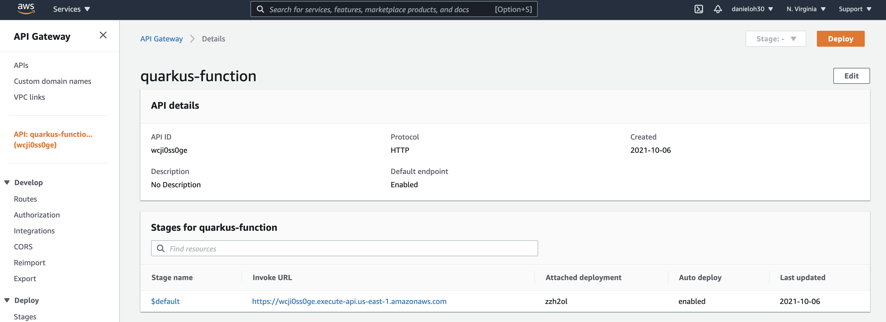

* AWS Identity and Access Management (IAM)

A new role for the Quarkus function will show up:

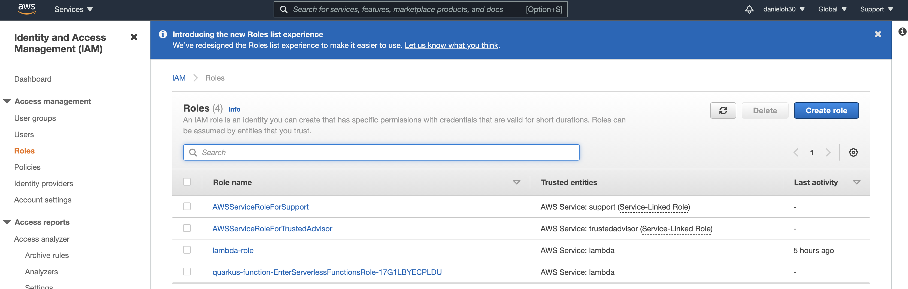

* AWS Lambda

A new Quarku function will show up:

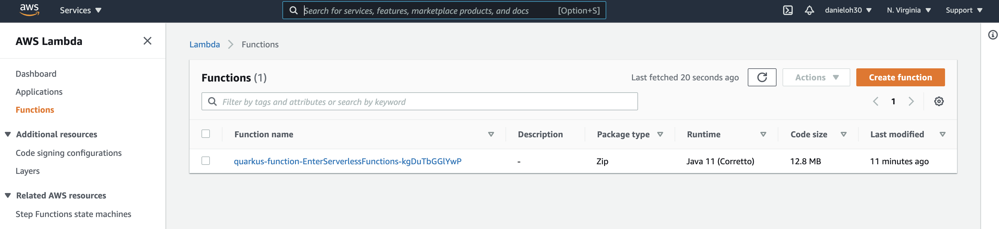

When you click on the function name, you can see the details such as package sizes as well as testing the function:

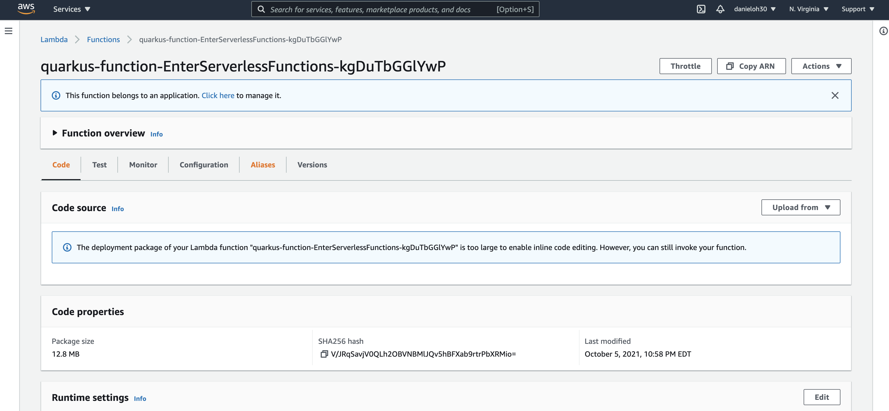

Access the function via HTTP gateway API URL. For example:

```shell
http https://wcji0ss0ge.execute-api.us-east-1.amazonaws.com/hello/greeting/awsprod
```

The output should look like:

```shell
HTTP/1.1 200 OK
Apigw-Requestid: GxAl3iaOIAMESWg=
Connection: keep-alive
Content-Length: 47
Content-Type: text/plain;charset=UTF-8
Date: Wed, 06 Oct 2021 03:14:19 GMT

Enter Serverless Functions with Quarkus, awsprod
```

Deploy a native executable to AWS Lambda. Package the application once again using the following command:

**Note**: When you build a native executable on macOS, you need to add the following configuration in _src/main/resources/application.properties_ for building a Linux format image using Docker runtime:

```yaml
quarkus.native.container-runtime=docker
```

```shell
quarkus build --native --no-tests
```

Or you can run the following maven command:

 ```shell
 ./mvnw clean package -DskipTests -Pnative
 ```

Once the build is _complete_, run the SAM CLI to deploy it using the following command. It takes a few minutes to complete the build:

```shell
sam deploy -t target/sam.native.yaml -g
```

Key a different stack name(`quarkus-native-function`) in the prompt:

```shell
Configuring SAM deploy
======================

	Looking for config file [samconfig.toml] :  Not found

	Setting default arguments for 'sam deploy'
	=========================================
	Stack Name [quarkus-function]: quarkus-native-function
	AWS Region [us-east-1]: 
	#Shows you resources changes to be deployed and require a 'Y' to initiate deploy
	Confirm changes before deploy [Y/n]: y
	#SAM needs permission to be able to create roles to connect to the resources in your template
	Allow SAM CLI IAM role creation [Y/n]: y
	#Preserves the state of previously provisioned resources when an operation fails
	Disable rollback [y/N]: n
	EnterServerlessFunctionNative may not have authorization defined, Is this okay? [y/N]: y
	Save arguments to configuration file [Y/n]: y
	SAM configuration file [samconfig.toml]: 
	SAM configuration environment [default]:
...

```

Once you deploy it successfully, go back to the AWS console. You have new resources now.

* AWS HTTP Gateway API

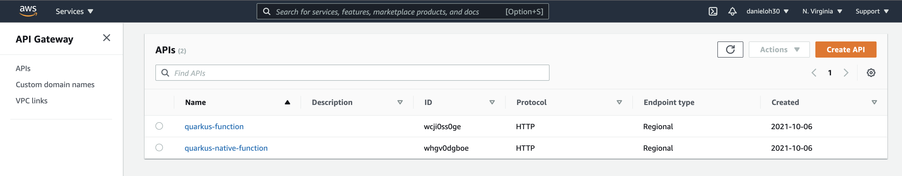

* AWS Lambda

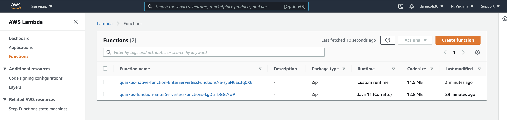

**Great job!** You can access the new Quarkus native function via the **new** HTTP Gateway API. For example,

```shell
http https://whgv0dgboe.execute-api.us-east-1.amazonaws.com/hello/greeting/awsnativeprod
```

The output should look like:

```shell
HTTP/1.1 200 OK
Apigw-Requestid: GxCsrjTBoAMESWg=
Connection: keep-alive
Content-Length: 45
Content-Type: text/plain;charset=UTF-8
Date: Wed, 06 Oct 2021 03:28:43 GMT

Enter Serverless Functions with Quarkus, awsnativeprod
```

You can showcase the performance stats to compare JVM vs. Native function in CloudWatch metrics:

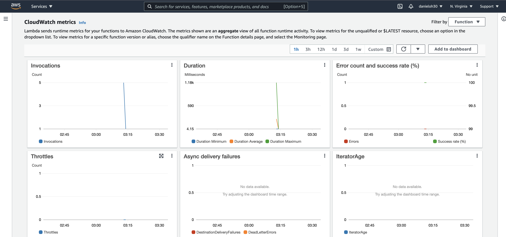

## Optimize the function and make it portable using Quarkus Funqy  <a name="OptimizeFunction"></a>

Add a Quarkus Funqy extension for Amazon Lambda deployment(_quarkus-funqy-amazon-lambda_) and remove the _quarkus-amazon-lambda-http_ extension:

```shell
quarkus ext add quarkus-funqy-amazon-lambda

quarkus ext remove quarkus-amazon-lambda-http
```

Update the `GreetingResource.java` file to use `@funq` annotation. Then, remove unnecessary packages and annotations(_@Path, @PathParam, @GET_).

```java
package org.acme;

import javax.inject.Inject;
import io.quarkus.funqy.Funq;

public class GreetingResource {

    @Inject
    GreetingService greetingService;

    @Funq
    public String greeting(String name) {
        return greetingService.greeting(name);
    }

    @Funq
    public String hello() {
        return "Hello Serverless";
    }
}
```

Before you'll deploy the function to AWS Lambda, you need to specify a function name. Add the following key and value in `application.properties` file:

```yaml
quarkus.funqy.export=greeting
```

Then, package the application once again using the following command:

```shell
quarkus build --no-tests
```

Or run the following maven package command:

```shell
./mvnw clean package -DskipTests
```

Now, you have a new bash script to make you easier to deploy the function to AWS Lambda without using HTTP Gateway API, S3, ARN:

* manage.sh - wrapper around aws lambda cli calls

Open and inspect `manage.sh` file in the _target_ directory.

You don't need to use the _SAM CLI_ directly since *manage.sh* script is a wrapper to create and delete a function simply.

Run the script file with _LAMBDA_ROLE_ARN_ resource. If you have no IAM roles, you need to create a new one in the AWS console. Find more information [here](https://docs.aws.amazon.com/IAM/latest/UserGuide/id_roles_create.html).

```shell
LAMBDA_ROLE_ARN=<YOUR_OWN_ARN> sh target/manage.sh create
```

The output should end with:

```shell
    "RevisionId": "6a4255d7-6f72-4f68-8d49-e8d683183d3b",
    "State": "Active",
    "LastUpdateStatus": "Successful"
```

**NOTE**: You might see _"State": "Pending"_ in the result then go back to AWS web console to check if a new function is created or not.

Go back to Amazon web console then validate a new function(`EnterServerlessFunctions`):

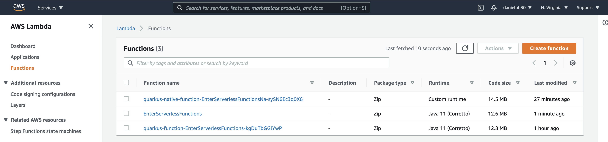

Click the function name(`EnterServerlessFunctions`) then select `Test` menu. Input `Funqy` in the text area and `greeting` in Name field:

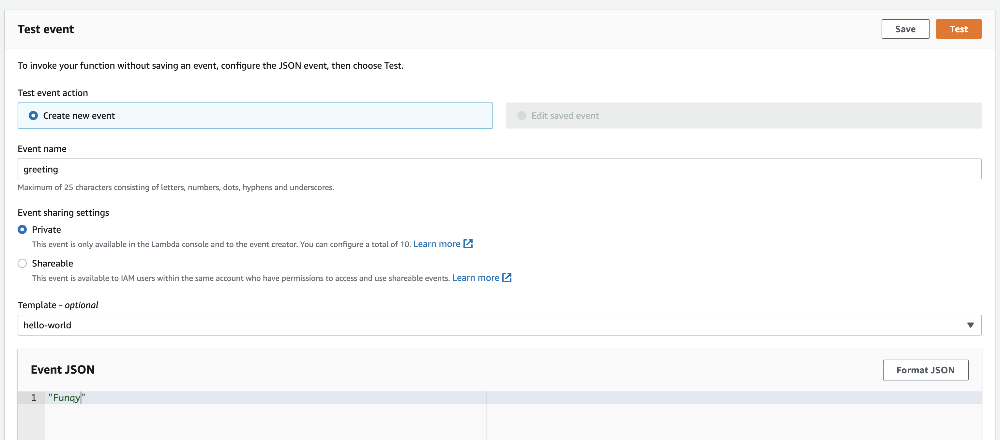

Click on `Test` button. Then, you will see the result as below:

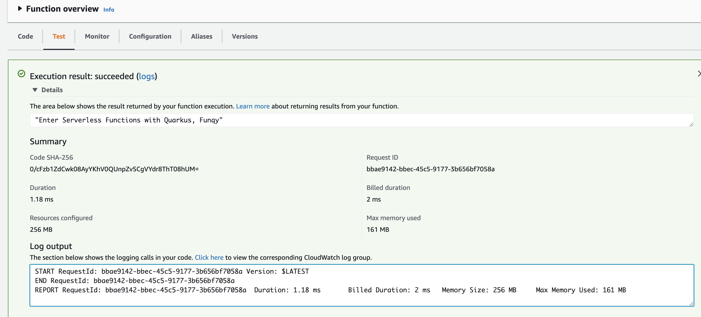

If the function is not required to run on AWS Lambda, remove it using the following command:

```shell
LAMBDA_ROLE_ARN=<YOUR_OWN_ARN> sh target/manage.sh delete
```

You can also remove the other HTTP gateway API functions using the following command:

```shell
sam delete --stack-name quarkus-native-function
```

If you want to deploy the Quarkus Funqy application as a native executables, you need to package a native executable first using `./mvnw clean package -Pnative` then run the wrapper script using `LAMBDA_ROLE_ARN=<YOUR_OWN_ARN> sh target/manage.sh native create`.

## Deploy the function to Red Hat OpenShift Serverless  <a name="DeployFunctiontoOCP"></a>

You'll use the [Developer Sandbox](https://developers.redhat.com/developer-sandbox) to deploy a Quarkus function. The sandbox allows developers to access Red Hat’s products and technologies without setup or configuration, and start developing quicker than ever before with our new sandbox environments for Red Hat OpenShift and CodeReady Workspaces. Try your hand at the technologies with our library of activities as well. You need to sign up the [Red Hat Developer Program](https://developers.redhat.com/developer-sandbox/get-started) first to provision a free sandbox. It will take less than 5 min from sign up to create a new cluster along the way.

Add an OpenShift and Knative Funqy extensions then remove an existing AWS extension:

```shell
quarkus ext add quarkus-funqy-knative-events quarkus-openshift

quarkus ext remove quarkus-funqy-amazon-lambda
```

Update the `application.properties` for OpenShift Serverless deployment:

**NOTE**: Replace `username` with your own account in the developer sandbox.

```yaml
kubernetes.deployment.target=knative
quarkus.container-image.group=username-dev
quarkus.container-image.registry=image-registry.openshift-image-registry.svc:5000
quarkus.kubernetes-client.trust-certs=true
quarkus.kubernetes.deploy=true
quarkus.openshift.build-strategy=docker
```

**Note**: If you want to use your own OpenShift cluster, you need to install _OpenShift Serverless Operator_ and _Knative-Serving_. Find more information [here](https://docs.openshift.com/container-platform/4.8/serverless/admin_guide/install-serverless-operator.html).

Make sure to log in the Developer Sandbox:

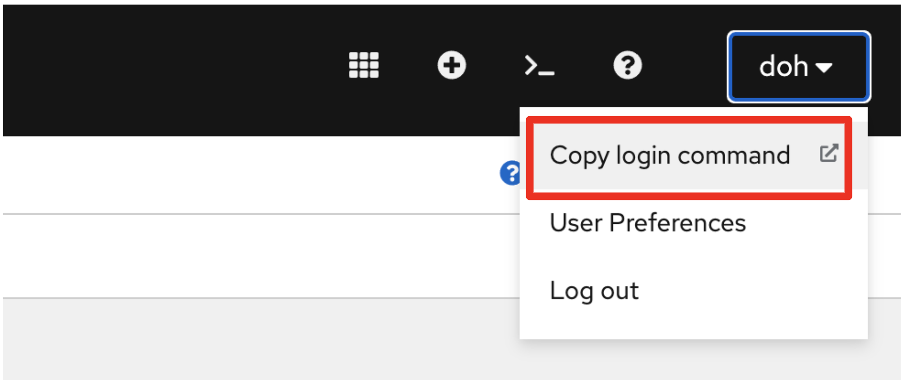

Click on `DevSandbox` then click on `Display Token`. It will show *Log in with this token*.

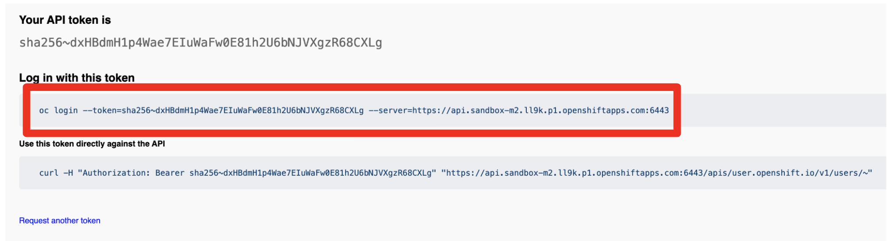

Copy the `oc login` command then paste it in your working terminal.

Run the following Maven command to deploy the function to OpenShift Serverless:

```shell
quarkus build --no-tests
```

Or run the following maven package command:

```shell
./mvnw clean package -DskipTests
```

The output will end with `BUILD SUCCESS`. You can overwrite the pod label to show the Quarkus icon by running the following [oc](https://docs.openshift.com/container-platform/4.9/cli_reference/openshift_cli/getting-started-cli.html) command:


```shell
oc label rev/enter-serverless-function-00001 app.openshift.io/runtime=quarkus --overwrite
```

_Note_ that if you deployed the function multiple times, the revision number (e.g. _00001_) should be different.

Add the **function** icon to the Knative service by running the following oc command:

```shell
oc label ksvc/enter-serverless-function boson.dev/function=true --overwrite
```


Go to the `Topology` view in _OpenShift Developer console_:

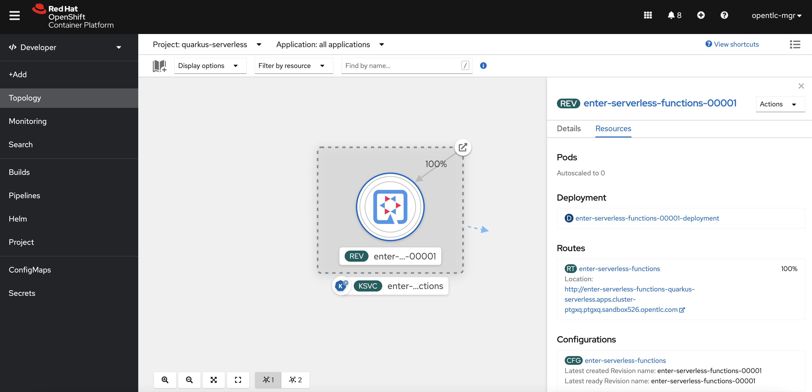

You might see the pod is already **terminated** since the scale-down-to-zero is `30` seconds by default in Knative Serving.

Copy the `Route URL` in Resource tab menu then invoke the function using HTTPie:

```shell
echo '"Daniel Oh"' | http https://enter-serverless-function-doh-dev.apps.sandbox-m2.ll9k.p1.openshiftapps.com
```

The output should look like:

```shell
HTTP/1.1 200 OK
content-length: 52
content-type: application/json
date: Wed, 06 Oct 2021 04:18:53 GMT
server: envoy
set-cookie: 1cb7429586be0d8d3ea316c3ea0770d9=e462212c7b0e92fa12bd25390c7be728; path=/; HttpOnly
x-envoy-upstream-service-time: 3943

"Enter Serverless Functions with Quarkus, Daniel Oh"
```

When you got back to the Topology view, you will see the Quarkus pod is automatically scaled up in a second:

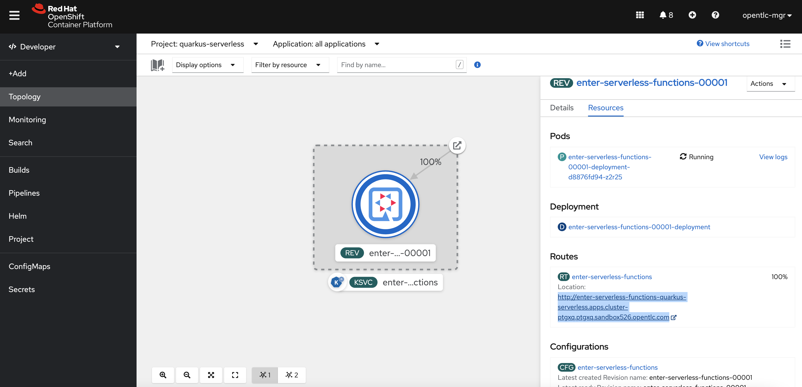

**Note**: When you deploy a native executable, the build will take more than 5 mins to finish. You might also have an out of memory error. To fix it, make sure to set `Dquarkus.native.native-image-xmx=4g`.

## Generate a new function project using Kn func CLI  <a name="GenerateNewFuncProject"></a>

**Note**: Red Hat OpenShift Serverless Function is still a Tech Preview feature. If you haven't installed Knative command (kn) yet, find more information [here](https://docs.openshift.com/container-platform/4.9/serverless/cli_tools/advanced-kn-config.html).

Run the following command:

```shell
cd ..
kn func create quarkus-func -l quarkus -t cloudevents
```

The output should look like:

```shell
Created quarkus Function in /serverless-workshop/quarkus-func
```

Inspect the new function project such as `func.yaml` and `Function.java`.

Deploy the function directly to Red Hat OpenShift. Make sure to change the directory where the _func.yaml_ exists:

**NOTE**: Replace `YOUR_USERNAME` with your own account in the developer sandbox.

```shell
cd quarkus-func
kn func deploy -r <YOUR_CONTAINER_REGISTRY> -n YOUR_USERNAME-dev -v

```

For example, the container registry looks like _quay.io/usrname_.

Kn func uses [Buildpack](https://buildpacks.io/) tool to build a function and deploy it to Kubernetes or OpenShift. Once the build is completed, you will see the output like:

```shell
Waiting for Knative Service to become ready
Function deployed at URL: https://quarkus-func-doh-dev.apps.sandbox-m2.ll9k.p1.openshiftapps.com
```

Go back to the Topology view, you will see a new function deployed. You can also overwrite the label by _oc_ command or OpenShift web console:

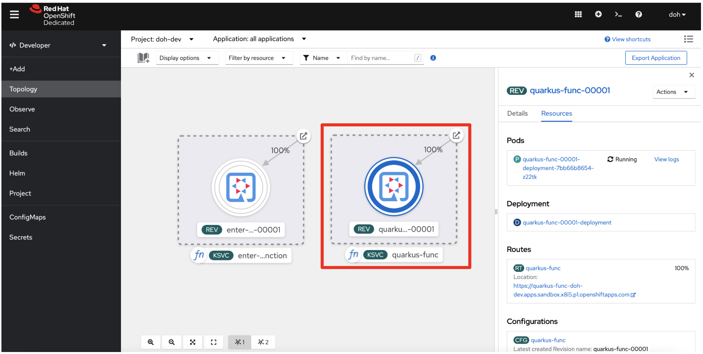

Send a new cloudevent message to the new function using Kn func emit:

```shell
kn func emit --data "Daniel Oh" --sink https://quarkus-func-doh-dev.apps.sandbox-m2.ll9k.p1.openshiftapps.com
```

The output should look like:

```shell
Context Attributes,
  specversion: 1.0
  type: function.output
  source: function
  id: 576e78f2-8f9f-4990-97d5-6ffd5cf62c9e
  datacontenttype: application/json
Data,
  {
    "message": "Daniel Oh"
  }
```

When you go to the pod logs in OpenShift console, you will see the same cloudevent message output:

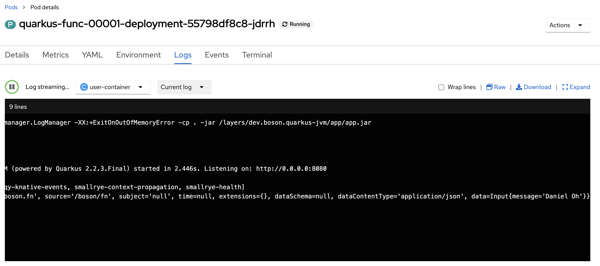

### Congratulations!

## Additional Resources  <a name="AdditionalResources"></a>

* [A guide to Java serverless functions](https://opensource.com/downloads/java-serverless-ebook)
* [Getting Started with Quarkus Serverless Functions](https://dzone.com/refcardz/getting-started-with-quarkus-serverless-functions)
* [Build your first Java Serverless Function using Quarkus Quick start](https://youtu.be/W2QPxfEU_bw)
* [Quarkus Funqy OpenShift Serverless](https://youtu.be/fQFVwoXWRto)
* [Deploying Quarkus based Amazon Lambdas](https://youtu.be/BOvxdY8cSHw)
* [Make Quarkus Serverless from Devfiles to OpenShift](https://youtu.be/3LtTQml7Gv8)
* [Microsweeper Demo with Quarkus on Azure Red Hat OpenShift](https://youtu.be/zYSQdX-tVsE)