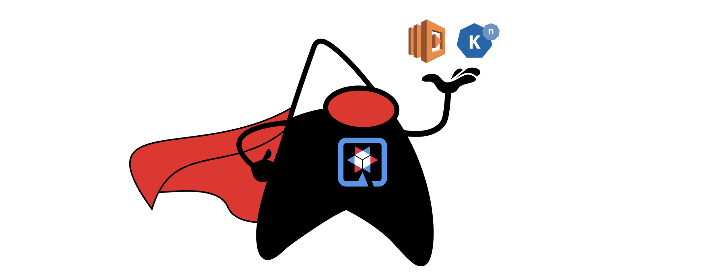

<h1 align="center"><a href="./instructions/1-prerequisites.adoc">Start here!</a></h1>

# Enter Serverless Functions Journey with Quarkus

This hands-on lab showcases how quickly developers can create cloud-native microservice project using [Quarkus](https://quarkus.io/). Then, the application can be deployed to a function to [AWS Lambda](https://aws.amazon.com/lambda/) and [Kubernetes](https://kubernetes.io/) [Knative](https://knative.dev/docs/) with `JVM` and `Native` mode.

## Instructions

* [Prerequisites](instructions/1-prerequisites.adoc)
* [Generate a new Quarkus project](instructions/2-generate-quarkus-project.adoc)
* [Deploy to AWS Lambda with HTTP API](instructions/3-deploy-aws-lambda.adoc)
* [Optimize the function and make it portable using Quarkus Funqy](instructions/4-optimize-quarkus-functions.adoc)
* [Deploy the function to Red Hat OpenShift Serverless](instructions/5-deploy-quarkus-functions.adoc)
* [Generate a new function project using Kn func CLI](instructions/6-generate-kn-functions.adoc)
* [Summary](instructions/7-summary.adoc)