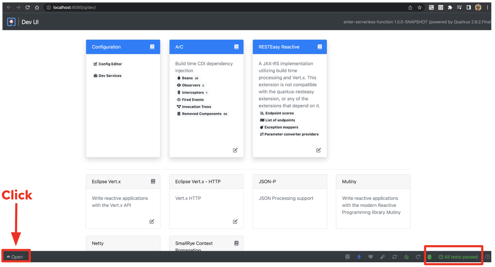
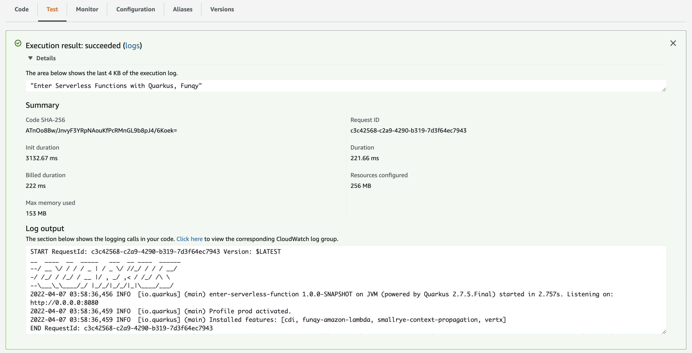
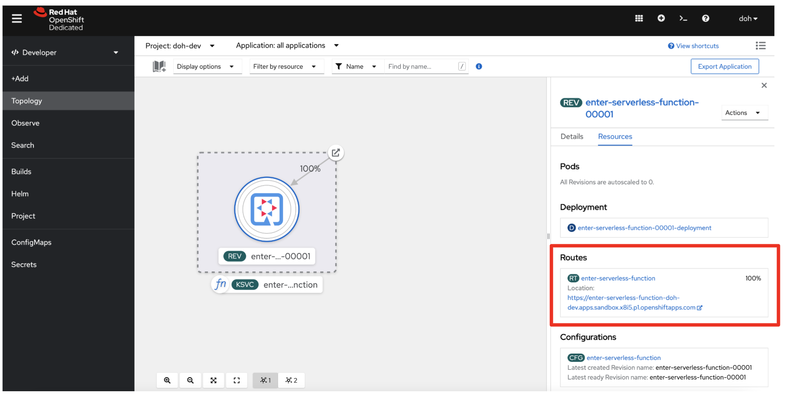
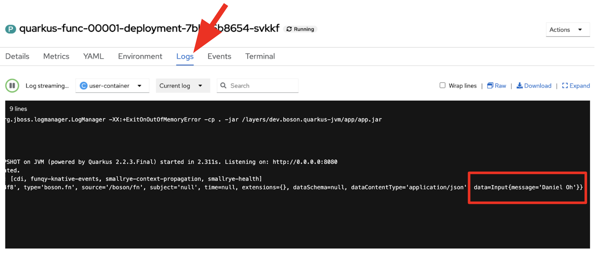

# Enter Serverless Functions with Quarkus

This demo showcases how quickly developers can create cloud-native microservice project using Quarkus. Then, the application can be deployed to a function to AWS Lambda and OpenShift Serverless with JVM and Native mode.

## Generate a new Quarkus project

Use [Quarkus CLI](https://quarkus.io/guides/cli-tooling#installing-the-cli) to scaffold a new Quarkus project based on Maven. Run the following command locally in the Terminal:

**Note**: You can use Maven or Gradle or Quarks tools in IDE instead of Quarkus CLI.

```shell
quarkus create enter-serverless-function

```

The output looks like:

```
Creating an app (default project type, see --help).
-----------

applying codestarts...
📚  java
🔨  maven
📦  quarkus
📝  config-properties
🔧  dockerfiles
🔧  maven-wrapper
🚀  resteasy-codestart

-----------
[SUCCESS] ✅  quarkus project has been successfully generated in:
--> /quarkus-world-tour/enter-serverless-function
-----------
Navigate into this directory and get started: quarkus dev

```

### Test the application locally

First thing first! Run the Quarkus Dev Mode using the following Quarkus CLI:

```shell
quarkus dev -f /quarkus-world-tour/enter-serverless-function
```

The output looks like:

```
Listening for transport dt_socket at address: 5005
__  ____  __  _____   ___  __ ____  ______ 
 --/ __ \/ / / / _ | / _ \/ //_/ / / / __/ 
 -/ /_/ / /_/ / __ |/ , _/ ,< / /_/ /\ \   
--\___\_\____/_/ |_/_/|_/_/|_|\____/___/   
2021-10-05 21:21:47,597 INFO  [io.quarkus] (Quarkus Main Thread) enter-serverless-function 1.0.0-SNAPSHOT on JVM (powered by Quarkus 2.2.3.Final) started in 1.746s. Listening on: http://localhost:8080
2021-10-05 21:21:47,601 INFO  [io.quarkus] (Quarkus Main Thread) Profile dev activated. Live Coding activated.
2021-10-05 21:21:47,602 INFO  [io.quarkus] (Quarkus Main Thread) Installed features: [cdi, resteasy, smallrye-context-propagation]

--
Tests paused
Press [r] to resume testing, [o] Toggle test output, [h] for more options>
```

Press `r` to start the _continuous testing_ then press `d` to open a _DEV UI_. It will open a new web browser then access to DEV UI (http://localhost:8080/q/dev/):



Verify the RESTful API if it works well. For example, you can use [HTTPie](https://httpie.io/) to invoke the endpoint:

```shell
http :8080/hello
```

The output should be:

```
HTTP/1.1 200 OK
Content-Length: 14
Content-Type: text/plain;charset=UTF-8

Hello RESTEasy
```

## Deploy to AWS Lambda with HTTP API

To deploy this application to AWS Lambda with HTTP API, add a new Quarkus extension(_quarkus-amazon-lambda-http_) using Quarkus CLI:

```shell
quarkus ext add quarkus-amazon-lambda-http
```

The output should be:

```
[SUCCESS] ✅  Extension io.quarkus:quarkus-amazon-lambda-http has been installed
```

You can also search what kinds of extensions are available to install on the working project:

```shell
quarkus ext --installable -s aws
```

The output looks like:

```
Listing extensions (default action, see --help).
Current Quarkus extensions installable: 

...                      
camel-quarkus-aws2-eventbridge                    
camel-quarkus-aws2-iam                                                    
camel-quarkus-aws2-msk                            
...                 
camel-quarkus-aws2-translate                      
quarkus-amazon-alexa                              
...                         
quarkus-amazon-lambda                             
quarkus-amazon-lambda-http                        
quarkus-amazon-lambda-rest                                               
quarkus-amazon-s3                                 
...                     
quarkus-amazon-ssm                                
quarkus-funqy-amazon-lambda                       
quarkus-hibernate-search-orm-elasticsearch-aws    
...
```

Before we deploy, let's add a new method and class to expose a new function on AWS Lambda.

Create a new `GreetingService.java` file in _src/main/java/org/acme/_. Then copy the following code:

```java
package org.acme;

import javax.enterprise.context.ApplicationScoped;

@ApplicationScoped
public class GreetingService {

    public String greeting(String name) {
        return "Enter Serverless Functions with Quarkus, " + name;
    }

}
```

Update `GreetingResource.java` file in _src/main/java/org/acme/_ to inject a CDI bean as well as modifying the return string in _hello_ method:

```java
    @Inject
    GreetingService greetingService;

    @GET
    @Produces(MediaType.TEXT_PLAIN)
    @Path("/greeting/{name}")
    public String greeting(String name) {
        return greetingService.greeting(name);
    }

    @GET
    @Produces(MediaType.TEXT_PLAIN)
    public String hello() {
        return "Hello Serverless";
    }
```

Verify both a new endpoint(_/hello/greeting/{name}_) and an existing one(_/hello_) using HTTPie:

```shell
http :8080/hello

HTTP/1.1 200 OK
Content-Length: 16
Content-Type: text/plain;charset=UTF-8

Hello Serverless
```

```shell
http :8080/hello/greeting/daniel

HTTP/1.1 200 OK
Content-Length: 47
Content-Type: text/plain;charset=UTF-8

Enter Serverless Functions with Quarkus, daniel
```

Stop the Dev Mode! Package the application using the following maven clean install:

```shell
./mvnw clean package
```

The output will end with `BUILD SUCCESS`.

Inspect generated files in the _target_ directory:

* function.zip - lambda deployment file
* bootstrap-example.sh - example bootstrap script for native deployments
* sam.jvm.yaml - (optional) for use with sam cli and local testing
* sam.native.yaml - (optional) for use with sam cli and native local testing

To simulate the function locally using [SAM CLI](https://docs.aws.amazon.com/serverless-application-model/latest/developerguide/serverless-sam-cli-install.html):

**NOTE**: You need to run a container runtime(e.g., Docker) to run the SAM emulator.

```shell
sam local start-api -t target/sam.jvm.yaml
```

Output should look like:

```
Mounting EnterServerlessFunctions at http://127.0.0.1:3000$default [X-AMAZON-APIGATEWAY-ANY-METHOD]
You can now browse to the above endpoints to invoke your functions. You do not need to restart/reload SAM CLI while working on your functions, changes will be reflected instantly/automatically. You only need to restart SAM CLI if you update your AWS SAM template
2021-10-05 22:48:29  * Running on http://127.0.0.1:3000/ (Press CTRL+C to quit)
```

Then, invoke the endpoint like:

```shell
Enter Serverless Functions with Quarkus, PFG
```

The output should look like:

```
HTTP/1.0 200 OK
Content-Length: 44
Content-Type: text/plain;charset=UTF-8
Date: Wed, 06 Oct 2021 02:49:22 GMT
Server: Werkzeug/1.0.1 Python/3.8.11

Enter Serverless Functions with Quarkus, PFG
```

Deploy the function to AWS Lambda using SAM CLI:

```shell
sam deploy -t target/sam.jvm.yaml -g
```

Input the configuration for the SAM Deploy with your preferences(e.g., stack name == `quarkus-function`). For example,

```
Configuring SAM deploy
======================

	Looking for config file [samconfig.toml] :  Not found

	Setting default arguments for 'sam deploy'
	=========================================
	Stack Name [sam-app]: quarkus-function
	AWS Region [us-east-1]: 
	#Shows you resources changes to be deployed and require a 'Y' to initiate deploy
	Confirm changes before deploy [y/N]: y
	#SAM needs permission to be able to create roles to connect to the resources in your template
	Allow SAM CLI IAM role creation [Y/n]: y
	EnterServerlessFunctions may not have authorization defined, Is this okay? [y/N]: y
	Save arguments to configuration file [Y/n]: y
	SAM configuration file [samconfig.toml]: 
	SAM configuration environment [default]: 
...

```

Then, you might need to confirm your configurations as below:

```
CloudFormation stack changeset
-------------------------------------------------------------------------------------------------------------------------------------
Operation                         LogicalResourceId                 ResourceType                      Replacement                     
-------------------------------------------------------------------------------------------------------------------------------------
+ Add                             EnterServerlessFunctionsHttpApi   AWS::Lambda::Permission           N/A                             
                                  EventPermission                                                                                     
+ Add                             EnterServerlessFunctionsRole      AWS::IAM::Role                    N/A                             
+ Add                             EnterServerlessFunctions          AWS::Lambda::Function             N/A                             
+ Add                             ServerlessHttpApiApiGatewayDefa   AWS::ApiGatewayV2::Stage          N/A                             
                                  ultStage                                                                                            
+ Add                             ServerlessHttpApi                 AWS::ApiGatewayV2::Api            N/A                             
-------------------------------------------------------------------------------------------------------------------------------------

Changeset created successfully. arn:aws:cloudformation:us-east-1:716861016243:changeSet/samcli-deploy1633488868/1e632117-3395-4b76-8037-bc6529ace78d


Previewing CloudFormation changeset before deployment
======================================================
Deploy this changeset? [y/N]: 
```

Press `y` then you will receive the outputs by CloudFormation in a few minutes. It should look like:

```
CloudFormation events from changeset
-------------------------------------------------------------------------------------------------------------------------------------
ResourceStatus                    ResourceType                      LogicalResourceId                 ResourceStatusReason            
-------------------------------------------------------------------------------------------------------------------------------------
CREATE_IN_PROGRESS                AWS::IAM::Role                    EnterServerlessFunctionsRole      Resource creation Initiated     
CREATE_IN_PROGRESS                AWS::IAM::Role                    EnterServerlessFunctionsRole      -                               
CREATE_COMPLETE                   AWS::IAM::Role                    EnterServerlessFunctionsRole      -                               
CREATE_IN_PROGRESS                AWS::Lambda::Function             EnterServerlessFunctions          -                               
CREATE_IN_PROGRESS                AWS::Lambda::Function             EnterServerlessFunctions          Resource creation Initiated     
CREATE_COMPLETE                   AWS::Lambda::Function             EnterServerlessFunctions          -                               
CREATE_IN_PROGRESS                AWS::ApiGatewayV2::Api            ServerlessHttpApi                 -                               
CREATE_COMPLETE                   AWS::ApiGatewayV2::Api            ServerlessHttpApi                 -                               
CREATE_IN_PROGRESS                AWS::ApiGatewayV2::Api            ServerlessHttpApi                 Resource creation Initiated     
CREATE_IN_PROGRESS                AWS::Lambda::Permission           EnterServerlessFunctionsHttpApi   Resource creation Initiated     
                                                                    EventPermission                                                   
CREATE_IN_PROGRESS                AWS::Lambda::Permission           EnterServerlessFunctionsHttpApi   -                               
                                                                    EventPermission                                                   
CREATE_IN_PROGRESS                AWS::ApiGatewayV2::Stage          ServerlessHttpApiApiGatewayDefa   -                               
                                                                    ultStage                                                          
CREATE_COMPLETE                   AWS::ApiGatewayV2::Stage          ServerlessHttpApiApiGatewayDefa   -                               
                                                                    ultStage                                                          
CREATE_IN_PROGRESS                AWS::ApiGatewayV2::Stage          ServerlessHttpApiApiGatewayDefa   Resource creation Initiated     
                                                                    ultStage                                                          
CREATE_COMPLETE                   AWS::Lambda::Permission           EnterServerlessFunctionsHttpApi   -                               
                                                                    EventPermission                                                   
CREATE_COMPLETE                   AWS::CloudFormation::Stack        quarkus-function                  -                               
-------------------------------------------------------------------------------------------------------------------------------------

CloudFormation outputs from deployed stack
----------------------------------------------------------------------------------------------------------------------------------------
Outputs                                                                                                                                
----------------------------------------------------------------------------------------------------------------------------------------
Key                 EnterServerlessFunctionsApi                                                                                        
Description         URL for application                                                                                                
Value               https://wcji0ss0ge.execute-api.us-east-1.amazonaws.com/                                                            
----------------------------------------------------------------------------------------------------------------------------------------

Successfully created/updated stack - quarkus-function in us-east-1
```

### Verify the Function in AWS Console

Go to [AWS Console](https://console.aws.amazon.com/) then navigate the following resources if they are automatically created along with the Quarkus function.

* AWS API Gateway

A new API gateway(e.g., _quarkus-function_) will show up when you specified it during the SAM deployment:


* AWS Identity and Access Management (IAM)

A new role for the Quarkus function will show up:


* AWS Lambda

A new Quarku function will show up:


When you click on the function name, you can see the details such as package sizes as well as testing the function:


Access the function via HTTP gateway API URL. For example:

```
http https://wcji0ss0ge.execute-api.us-east-1.amazonaws.com/hello/greeting/daniel
```

The output should look like:

```
HTTP/1.1 200 OK
Apigw-Requestid: GxAl3iaOIAMESWg=
Connection: keep-alive
Content-Length: 47
Content-Type: text/plain;charset=UTF-8
Date: Wed, 06 Oct 2021 03:14:19 GMT

Enter Serverless Functions with Quarkus, daniel
```

Deploy a native executable to AWS Lambda. Package the application once again using the following command:

 ```shell
 ./mvnw clean package -DskipTests -Pnative
 ```

Once the build is _complete_, run the SAM CLI to deploy it using the following command:

```shell
sam deploy -t target/sam.native.yaml -g
```

Key a different stack name(`quarkus-native-function`) in the prompt:

```
Configuring SAM deploy
======================

	Looking for config file [samconfig.toml] :  Not found

	Setting default arguments for 'sam deploy'
	=========================================
	Stack Name [sam-app]: quarkus-native-function
	AWS Region [us-east-1]: 
	#Shows you resources changes to be deployed and require a 'Y' to initiate deploy
	Confirm changes before deploy [y/N]: 
	#SAM needs permission to be able to create roles to connect to the resources in your template
	Allow SAM CLI IAM role creation [Y/n]: y
	EnterServerlessFunctionsNative may not have authorization defined, Is this okay? [y/N]: y
	Save arguments to configuration file [Y/n]: y
	SAM configuration file [samconfig.toml]: 
	SAM configuration environment [default]: 
...

```

Once you deploy it successfully, go back to the AWS console. You have new resources now.

* AWS HTTP Gateway API


* AWS Lambda


Great job! You can access the new Quarkus native function via the new HTTP Gateway API. For example,

```
http https://whgv0dgboe.execute-api.us-east-1.amazonaws.com/hello/greeting/jeff

HTTP/1.1 200 OK
Apigw-Requestid: GxCsrjTBoAMESWg=
Connection: keep-alive
Content-Length: 45
Content-Type: text/plain;charset=UTF-8
Date: Wed, 06 Oct 2021 03:28:43 GMT

Enter Serverless Functions with Quarkus, jeff
```

You can showcase the performance stats to compare JVM vs. Native function in CloudWatch metrics:


## Optimize the function and make it portable using Quarkus Funqy

Add a Quarkus Funqy extension for Amazon Lambda deployment(_quarkus-funqy-amazon-lambda_) and remove the _quarkus-amazon-lambda-http_ extension:

```shell
quarkus ext add quarkus-funqy-amazon-lambda

quarkus ext remove quarkus-amazon-lambda-http
```

Update the `GreetingResource.java` file to use `@funq` annotation. Then, remove unnecessary packages and annotations(_@Path, @PathParam, @GET_).

```java
package org.acme;

import javax.inject.Inject;
import io.quarkus.funqy.Funq;

public class GreetingResource {

    @Inject
    GreetingService greetingService;

    @Funq
    public String greeting(String name) {
        return greetingService.greeting(name);
    }

    @Funq
    public String hello() {
        return "Hello Serverless";
    }
}
```

Before you'll deploy the function to AWS Lambda, you need to specify a function name. Add the following key and value in `application.properties` file:

```yaml
quarkus.funqy.export=greeting
```

Then, package the application once again using the following command:

```shell
./mvnw clean package -DskipTests
```

Now, you have a new bash script to make you easier to deploy the function to AWS Lambda without using HTTP Gateway API, S3, ARN:

* manage.sh - wrapper around aws lambda cli calls

Open and inspect `manage.sh` file in the _target_ directory.

You don't need to use the _SAM CLI_ directly since *manage.sh* script is a wrapper to create and delete a function simply.

Run the script file with _LAMBDA_ROLE_ARN_ resource. If you have no IAM roles, you need to create a new one in the AWS console. Find more information [here](https://docs.aws.amazon.com/IAM/latest/UserGuide/id_roles_create.html).

```shell
LAMBDA_ROLE_ARN=<YOUR_OWN_ARN> sh target/manage.sh create
```

The output should end with:

```
    "RevisionId": "6a4255d7-6f72-4f68-8d49-e8d683183d3b",
    "State": "Active",
    "LastUpdateStatus": "Successful"
```

Go back to Amazon web console then validate a new function(`EnterServerlessFunctions`):


Click the function name(`EnterServerlessFunctions`) then select `Test` menu. Input `Funqy` in the text area and `greeting` in Name field:


Click on `Test` button. Then, you will see the result as below:



If the function is not required to run on AWS Lambda, remove it using the following command:

```shell
LAMBDA_ROLE_ARN=<YOUR_OWN_ARN> sh target/manage.sh delete
```

You can also remove the other HTTP gateway API functions using the following command:

```shell
sam delete --stack-name quarkus-native-function
```

If you want to deploy the Quarkus Funqy application as a native executables, you need to package a native executable first using `./mvnw clean package -Pnative` then run the wrapper script using `LAMBDA_ROLE_ARN=<YOUR_OWN_ARN> sh target/manage.sh native create`.

## Deploy the function to Red Hat OpenShift Serverless

Add an OpenShift and Knative Funqy extensions then remove an existing AWS extension:

```shell
quarkus ext add quarkus-funqy-knative-events quarkus-openshift

quarkus ext remove quarkus-funqy-amazon-lambda
```

Update the `application.properties` for OpenShift Serverless deployment:

```yaml
kubernetes.deployment.target=knative
quarkus.container-image.group=quarkus-serverless
quarkus.container-image.registry=image-registry.openshift-image-registry.svc:5000
quarkus.kubernetes-client.trust-certs=true
quarkus.kubernetes.deploy=true
quarkus.openshift.build-strategy=docker
```

**Note**: If you haven't installed _OpenShift Serverless Operator_ and _Knative-Serving_ yet, find more information [here](https://docs.openshift.com/container-platform/4.8/serverless/admin_guide/install-serverless-operator.html).
build/deploy

Run the following Maven command to deploy the function to OpenShift Serverless:

```shell
./mvnw clean package -DskipTests
```

The output will end with `BUILD SUCCESS`. Go to the `Topology` view in _OpenShift Developer console_:



You might see the pod is already **terminated** since the scale-down-to-zero is `30` seconds by default in Knative Serving.

Copy the `Route URL` in Resource tab menu then invoke the function using HTTPie:

```shell
echo '"Daniel Oh"' | http http://enter-serverless-functions-quarkus-serverless.apps.cluster-ptgxq.ptgxq.sandbox526.opentlc.com/
```

The output should look like:

```
HTTP/1.1 200 OK
content-length: 52
content-type: application/json
date: Wed, 06 Oct 2021 04:18:53 GMT
server: envoy
set-cookie: 1cb7429586be0d8d3ea316c3ea0770d9=e462212c7b0e92fa12bd25390c7be728; path=/; HttpOnly
x-envoy-upstream-service-time: 3943

"Enter Serverless Functions with Quarkus, Daniel Oh"
```

When you got back to the Topology view, you will see the Quarku pod is automatically scaled up in a second:


**Note**: When you deploy a native executable, the build will take more than 5 mins to finish. You might also have an out of memory error. To fix it, make sure to set `Dquarkus.native.native-image-xmx=4g`.


## Generate a new function project using Kn func CLI

**Note**: Red Hat OpenShift Serverless Function is still a Tech Preview feature. If you haven't installed Kn CLI yet, find more information [here](https://docs.openshift.com/container-platform/4.8/serverless/cli_tools/advanced-kn-config.html).

Run the following command:

```shell
kn func create quarkus-func -l quarkus -t events
```

The output should look like:

```
Function name: quarkus-func
Runtime:       quarkus
Template:      events
```

Inspect the new function project such as `func.yaml` and `Function.java`.

Deploy the function directly to Red Hat OpenShift:

```shell
kn func deploy -r <YOUR_CONTAINER_REGISTRY> -n quarkus-serverless -v

```

For example, the container registry looks like _quay.io/usrname_.

Kn func uses Buildpack tool to build a function and deploy it to Kubernetes or OpenShift. Once the build is completed, you will see the output like:

```
Waiting for Knative Service to become ready
Function deployed at URL: http://quarkus-func-quarkus-serverless.apps.cluster-ptgxq.ptgxq.sandbox526.opentlc.com
```

Go back to the Topology view, you will see a new function deployed:


Send a new cloudevent message to the new function using Kn func emit:

```shell
kn func emit --data "Daniel Oh" --sink http://quarkus-func-quarkus-serverless.apps.cluster-ptgxq.ptgxq.sandbox526.opentlc.com/
```

The output should look like:

```shell
Context Attributes,
  specversion: 1.0
  type: function.output
  source: function
  id: 576e78f2-8f9f-4990-97d5-6ffd5cf62c9e
  datacontenttype: application/json
Data,
  {
    "message": "Daniel Oh"
  }
```

When you go to the pod logs in OpenShift console, you will see the same cloudevent message output:



### Congratulations!