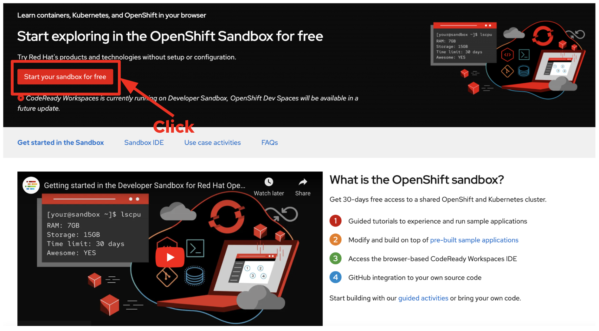
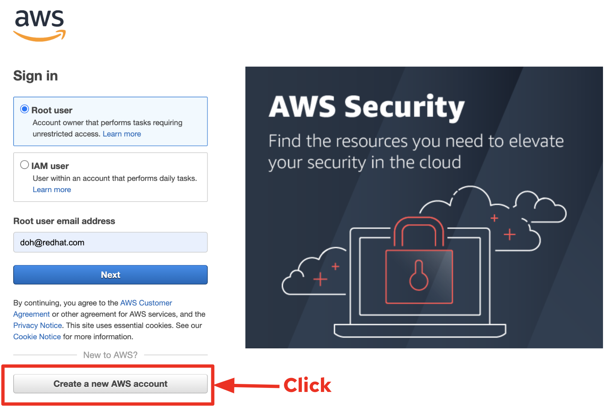

= 1. Prerequisites

Before you get started with the hands-on labs, if you already haven't user accounts in the sandbox and AWS, you might need to sign in two cloud services for function deployments such as OpenShift(Kubernetes) and AWS Lambda as below:

* Sign up the [Developer Sandbox for Red Hat OpenShift](https://developers.redhat.com/developer-sandbox/get-started) to deploy Quarkus serverless functions to Kubernetes/OpenShift cluster. Click on `Start your sandbox for free` in the _Get Started in the Sandbox_ page. You will need to create a new user account using your email address then your sandbox will stand up in 5 minutes.

* Sing up [Amazon Web Services](https://aws.amazon.com/marketplace/management/signin). You might need to add your personal credit card information which *won't* charge for the function deployment during the lab. Because the function will be deleted at the end of the workshop.

* https://developers.redhat.com/products/openjdk/download[JDK 17] installed with `JAVA_HOME` configured appropriately

* https://maven.apache.org/download.cgi[Apache Maven 3.9.1^]

* https://docs.openshift.com/container-platform/latest/serverless/install/installing-kn.html[Knative CLI^]

* https://quarkus.io/guides/cli-tooling[Quarkus CLI^]

* https://httpie.io[HTTPie^]

➡️ link:./2-generate-quarkus-project.adoc[2. Generate a new Quarkus project]
