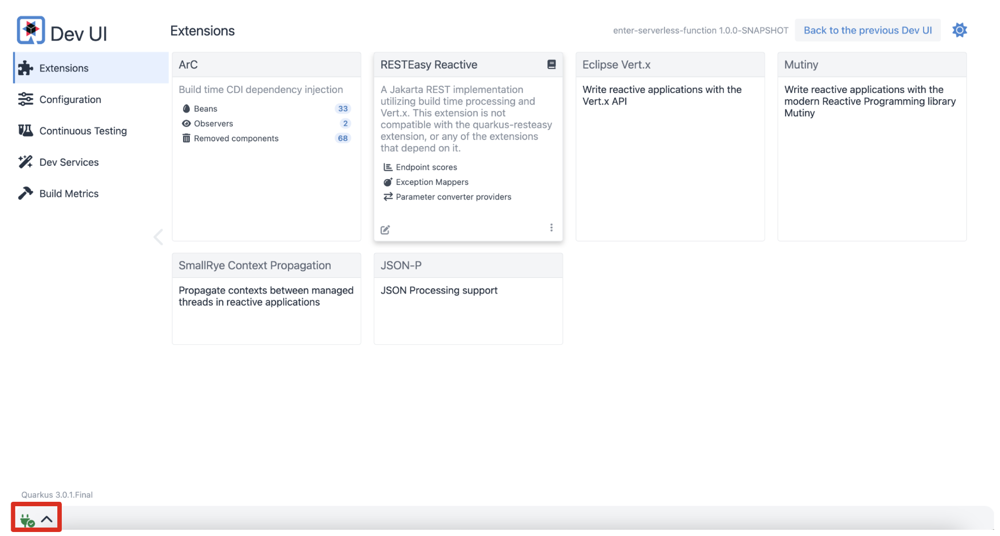
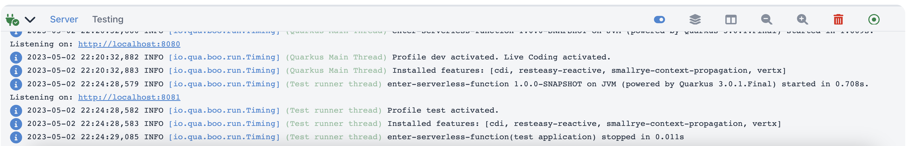

= 2. Generate a new Quarkus project

Use `Quarkus CLI` to scaffold a new Quarkus project based on Maven. Run the following command locally in the Terminal:

[NOTE]
====
You can use https://maven.apache.org/download.cgi[Maven^] or https://gradle.org/install[Gradle^] or Quarks tools in IDE instead of **Quarkus CLI**.
====

[source,sh]
----
quarkus create app enter-serverless-function

----

The output looks like:

[source,sh]
----
Creating an app (default project type, see --help).
-----------

applying codestarts...
📚  java
🔨  maven
📦  quarkus
📝  config-properties
🔧  dockerfiles
🔧  maven-wrapper
🚀  resteasy-codestart

-----------
[SUCCESS] ✅  quarkus project has been successfully generated in:
--> /YOUR_WORKING_DIR/enter-serverless-function
-----------
Navigate into this directory and get started: quarkus dev
----

== Test the application locally

First thing first! Run the Quarkus Dev Mode using the following Quarkus CLI:

[source,sh]
----
cd enter-serverless-function
quarkus dev
----

The output looks like:

[source,sh]
----
Listening for transport dt_socket at address: 5005

__  ____  __  _____   ___  __ ____  ______ 
 --/ __ \/ / / / _ | / _ \/ //_/ / / / __/ 
 -/ /_/ / /_/ / __ |/ , _/ ,< / /_/ /\ \   
--\___\_\____/_/ |_/_/|_/_/|_|\____/___/   
2022-06-23 11:52:08,492 INFO  [io.quarkus] (Quarkus Main Thread) enter-serverless-functions 1.0.0-SNAPSHOT on JVM (powered by Quarkus 2.10.0.Final) started in 1.508s. Listening on: http://localhost:8080

2022-06-23 11:52:08,508 INFO  [io.quarkus] (Quarkus Main Thread) Profile dev activated. Live Coding activated.
2022-06-23 11:52:08,508 INFO  [io.quarkus] (Quarkus Main Thread) Installed features: [cdi, resteasy-reactive, smallrye-context-propagation, vertx]

--
Tests paused
Press [r] to resume testing, [o] Toggle test output, [:] for the terminal, [h] for more options>
----

Press `r` to start the _continuous testing_ then press `d` to open a _DEV UI_. It will open a new web browser then access to http://localhost:8080/q/dev/[DEV UI^].

You'll also see `All tests passed` on the right bottom that points the result of the continuous testing.

When you click on `Open` on the left bottom, you will see the readonly log terminal. 

Verify the RESTful API if it works well. For example, use https://httpie.io[HTTPie^] to invoke the endpoint in your local terminal:

[source,sh]
----
http :8080/hello
----

The output should be:

[source,sh]
----
HTTP/1.1 200 OK
Content-Type: text/plain;charset=UTF-8
content-length: 28

Hello from RESTEasy Reactive
----

You can also use `curl` command to access the endpoint:

[source,sh]
----
curl localhost:8080/hello
----

Keep *running* your Quarkus dev mode!! 

➡️ link:./3-deploy-aws-lambda.adoc[3. Deploy to AWS Lambda with HTTP API]

⬅️ link:./1-prerequisites.adoc[1. Prerequisites]