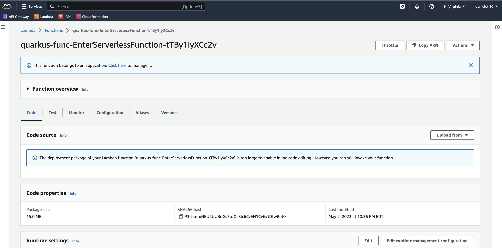
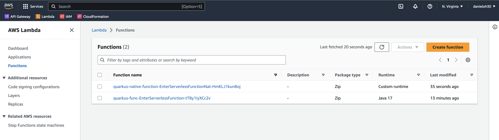

= 3. Deploy to AWS Lambda with HTTP API

To deploy this application to AWS Lambda with HTTP API, add a new Quarkus extension(_quarkus-amazon-lambda-http_) using Quarkus CLI:

[source,sh]
----
quarkus ext add quarkus-amazon-lambda-http
----

The output should be:

[source,sh]
----
[SUCCESS] ✅  Extension io.quarkus:quarkus-amazon-lambda-http has been installed
----

You can also search what kinds of extensions are available to install on the working project:

[source,sh]
----
quarkus ext --installable -s aws
----

The output looks like:

[source,sh]
----
Listing extensions (default action, see --help).
Current Quarkus extensions installable: 

✬ ArtifactId                                         Extension Name
✬ camel-quarkus-aws2-athena                          Camel AWS 2 Athena
✬ camel-quarkus-aws2-cw                              Camel AWS 2 CloudWatch
✬ camel-quarkus-aws2-ddb                             Camel AWS 2 DynamoDB                      
...                 
✬ quarkus-amazon-lambda                              AWS Lambda
✬ quarkus-amazon-lambda-http                         AWS Lambda HTTP
✬ quarkus-amazon-lambda-rest                         AWS Lambda Gateway REST API
✬ quarkus-amazon-lambda-xray                         AWS Lambda X-Ray
✬ quarkus-amazon-s3                                  Amazon S3
✬ quarkus-amazon-secretsmanager                      Amazon Secrets Manager
✬ quarkus-amazon-ses                                 Amazon SES
✬ quarkus-amazon-sns                                 Amazon SNS
✬ quarkus-amazon-sqs                                 Amazon SQS
✬ quarkus-amazon-ssm                                 Amazon SSM
✬ quarkus-funqy-amazon-lambda                        Funqy AWS Lambda Binding
  quarkus-hibernate-search-orm-elasticsearch-aws     Hibernate Search + Elasticsearch - AWS authentication and request signing
----

Before we deploy, let's add a new method and class to expose a new function on AWS Lambda.

Create a new `GreetingService.java` file in _src/main/java/org/acme/_. Then copy the following code:

[source,java]
----
package org.acme;

import javax.enterprise.context.ApplicationScoped;

@ApplicationScoped
public class GreetingService {

    public String greeting(String name) {
        return "Enter Serverless Functions with Quarkus, " + name;
    }

}
----

Update `GreetingResource.java` file in _src/main/java/org/acme/_ to inject a CDI bean as well as modifying the return string in _hello_ method:

[source,java]
----
package org.acme;

import javax.inject.Inject;
import javax.ws.rs.GET;
import javax.ws.rs.Path;

@Path("/hello")
public class GreetingResource {

    @Inject
    GreetingService greetingService;

    @GET
    @Path("/greeting/{name}")
    public String greeting(String name) {
        return greetingService.greeting(name);
    }

    @GET
    public String hello() {
        return "Hello Serverless";
    }
}
----

Verify both a new endpoint(_/hello/greeting/{name}_) and an existing one(_/hello_) using HTTPie:

[source,sh]
----
http :8080/hello
----

The output looks like:

[source,sh]
----
HTTP/1.1 200 OK
Content-Length: 16
Content-Type: text/plain;charset=UTF-8

Hello Serverless
----

Access another REST API:

[source,sh]
----
http :8080/hello/greeting/daniel
----

The output looks like:

[source,sh]
----
HTTP/1.1 200 OK
Content-Length: 47
Content-Type: text/plain;charset=UTF-8

Enter Serverless Functions with Quarkus, daniel
----

[NOTE]
====
You don’t need to stop and re-run the serverless application because Quarkus will reload the changes automatically via the `Live Coding` feature.
====

To mirror the AWS Lambda environment as closely as possible in a dev environment, the Quarkus Amazon Lambda extension boots up a mock AWS Lambda event server in Quarkus Dev and Test mode. This mock event server simulates a true AWS Lambda environment.

While running in *Quarkus Dev Mode*, you can feed events to it by doing an `HTTP POST` to http://localhost:8080. The mock event server will receive the events and your lambda will be invoked. You can perform live coding on your lambda and changes will automatically be recompiled and available the next invocation you make.

Furthermore, if you're still running the *continuous testing*, you can see the following `TEST REPORT` in the terminal because you only changed the business application code (e.g. _hello()_) without the test code. 

[source,java]
----
2022-06-17 10:54:13,019 ERROR [io.qua.test] (Test runner thread) >>>>>>>>>>>>>>>>>>>> 1 TEST FAILED <<<<<<<<<<<<<<<<<<<<
2022-06-17 10:54:13,407 ERROR [io.qua.test] (Test runner thread) ==================== TEST REPORT #2 ====================
2022-06-17 10:54:13,407 ERROR [io.qua.test] (Test runner thread) Test GreetingResourceTest#testHelloEndpoint() failed 
: java.lang.AssertionError: 1 expectation failed.
Response body doesn't match expectation.
Expected: is "Hello from RESTEasy Reactive"
  Actual: Hello Serverless
----

To fix the test error, update the test case along with the modified __hello__ function. Open the `GreetingResourceTest.java` file in __src/test/java/org/acme__ directory and replace `testHelloEndpoint()` method with the following code:

[source,java]
----
    @Test
    public void testHelloEndpoint() {
        given()
          .when().get("/hello")
          .then()
             .statusCode(200)
             .body(is("Hello Serverless"));
    }
----

`Save` the file then go back to the terminal where Quarkus Dev mode is running.

Then, you will see the test case passed as below:

[source,sh]
----
All 1 test is passing (0 skipped), 1 test was run in 828ms. Tests completed at 10:59:56 due to changes to GreetingResourceTest.class.
----

Stop the Dev Mode using `CTRL-C`! Package the application using the following Quarkus CLI:

[source,sh]
----
quarkus build --no-tests
----

or Use maven package command as below:

[source,sh]
----
./mvnw clean package
----

The output will end with `BUILD SUCCESS`.

Inspect generated files in the _target_ directory:

* **function.zip** - lambda deployment file
* **bootstrap-example.sh** - example bootstrap script for native deployments
* **sam.jvm.yaml** - (optional) for use with sam cli and local testing
* **sam.native.yaml** - (optional) for use with sam cli and native local testing

[NOTE]
====
If you have already tested the function using live coding with Quarkus Dev mode, you can skip the function simulation locally. Then jump into the deployment step.
====

To simulate the function locally using https://docs.aws.amazon.com/serverless-application-model/latest/developerguide/serverless-sam-cli-install.html[SAM CLI^]. The AWS SAM command line interface (CLI) requires you to set AWS credentials so that it can make calls to AWS services on your behalf. Find more information how to set up AWS credentials for SAM CLI https://docs.aws.amazon.com/serverless-application-model/latest/developerguide/serverless-getting-started-set-up-credentials.html[here^].

[NOTE]
====
You need to run a container runtime(e.g. https://www.docker.com/products/docker-desktop[Docker^]) to run the SAM emulator.
====

[source,sh]
----
sam local start-api -t target/sam.jvm.yaml
----

Output should look like:

[source,sh]
----
Mounting EnterServerlessFunction at http://127.0.0.1:3000$default[X-AMAZON-APIGATEWAY-ANY-METHOD^]
You can now browse to the above endpoints to invoke your functions. You do not need to restart/reload SAM CLI while working on your functions, changes will be reflected instantly/automatically. You only need to restart SAM CLI if you update your AWS SAM template
2022-06-17 11:06:17  * Running on http://127.0.0.1:3000/ (Press CTRL+C to quit)
----

Then, invoke the endpoint like in another terminal:

 * HTTPie:

[source,sh]
----
http http://127.0.0.1:3000/hello/greeting/awslocal
----

 * Curl:

[source,sh]
----
curl http://127.0.0.1:3000/hello
----

When you go back to the terminal where the sam local command is running, you will see that the Quarkus application gets started. It takes a few seconds to complete getting ready in Quarkus runtime.

Then, the output should look like:

[source,sh]
----
HTTP/1.0 200 OK
Content-Type: text/plain;charset=UTF-8
Date: Fri, 17 Jun 2022 15:07:26 GMT
Server: Werkzeug/1.0.1 Python/3.8.13
content-length: 49

Enter Serverless Functions with Quarkus, awslocal
----

Stop the local testing by `CTRL-C`!

[NOTE]
====
You can also use the live coding feature for Lambda functions development locally. Find more information https://quarkus.io/guides/amazon-lambda#live-coding-and-unitintegration-testing[here^]
====

If you haven't already configured `AWS credential` locally (e.g., **~/.aws/credentials**) yet, run the following aws command line:

[source,sh]
----
aws configure
----

Find more information about https://docs.aws.amazon.com/cli/latest/userguide/cli-configure-files.html[Configuration and credential file settings^].

Deploy the function to AWS Lambda using SAM CLI:

[source,sh]
----
sam deploy -t target/sam.jvm.yaml -g
----

Input the configuration for the SAM Deploy with your preferences (e.g., Stack Name: `quarkus-function`). For example,

[source,sh]
----
Configuring SAM deploy
======================

	Looking for config file [samconfig.toml] :  Not found

	Setting default arguments for 'sam deploy'
	=========================================
	Stack Name [sam-app]: quarkus-function
	AWS Region [us-east-1]: 
	#Shows you resources changes to be deployed and require a 'Y' to initiate deploy
	Confirm changes before deploy [y/N]: y
	#SAM needs permission to be able to create roles to connect to the resources in your template
	Allow SAM CLI IAM role creation [Y/n]: y
	#Preserves the state of previously provisioned resources when an operation fails
	Disable rollback [y/N]: n
	EnterServerlessFunction may not have authorization defined, Is this okay? [y/N]: y
	Save arguments to configuration file [Y/n]: y
	SAM configuration file [samconfig.toml]: 
	SAM configuration environment [default]:
...
----

[NOTE]
====
If you have a `S3 Bucket does not exist` error, you probably have old CloudFormation Stack that looks up to the `aws-sam-cli-managed-default-samclisourcebucket` service. In that case, Go to *CloundFormation Service* in the AWS portal. Then, delete *aws-sam-cli-managed-default* stack.
====

Then, you might need to confirm your configurations as below:

[source,sh]
----
CloudFormation stack changeset
-------------------------------------------------------------------------------------------------------------------------------------
Operation                         LogicalResourceId                 ResourceType                      Replacement                     
-------------------------------------------------------------------------------------------------------------------------------------
+ Add                             EnterServerlessFunctionsHttpApi   AWS::Lambda::Permission           N/A                             
                                  EventPermission                                                                                     
+ Add                             EnterServerlessFunctionsRole      AWS::IAM::Role                    N/A                             
+ Add                             EnterServerlessFunctions          AWS::Lambda::Function             N/A                             
+ Add                             ServerlessHttpApiApiGatewayDefa   AWS::ApiGatewayV2::Stage          N/A                             
                                  ultStage                                                                                            
+ Add                             ServerlessHttpApi                 AWS::ApiGatewayV2::Api            N/A                             
-------------------------------------------------------------------------------------------------------------------------------------

Changeset created successfully. arn:aws:cloudformation:us-east-1:716861016243:changeSet/samcli-deploy1633488868/1e632117-3395-4b76-8037-bc6529ace78d

Previewing CloudFormation changeset before deployment
======================================================
Deploy this changeset? [y/N]: 
----

Press `y` then you will receive the outputs by CloudFormation in a few minutes. It should look like:

[source,sh]
----
CloudFormation events from changeset
-------------------------------------------------------------------------------------------------------------------------------------
ResourceStatus                    ResourceType                      LogicalResourceId                 ResourceStatusReason            
-------------------------------------------------------------------------------------------------------------------------------------
CREATE_IN_PROGRESS                AWS::IAM::Role                    EnterServerlessFunctionsRole      Resource creation Initiated     
CREATE_IN_PROGRESS                AWS::IAM::Role                    EnterServerlessFunctionsRole      -                               
CREATE_COMPLETE                   AWS::IAM::Role                    EnterServerlessFunctionsRole      -                               
CREATE_IN_PROGRESS                AWS::Lambda::Function             EnterServerlessFunctions          -                               
CREATE_IN_PROGRESS                AWS::Lambda::Function             EnterServerlessFunctions          Resource creation Initiated     
CREATE_COMPLETE                   AWS::Lambda::Function             EnterServerlessFunctions          -                               
CREATE_IN_PROGRESS                AWS::ApiGatewayV2::Api            ServerlessHttpApi                 -                               
CREATE_COMPLETE                   AWS::ApiGatewayV2::Api            ServerlessHttpApi                 -                               
CREATE_IN_PROGRESS                AWS::ApiGatewayV2::Api            ServerlessHttpApi                 Resource creation Initiated     
CREATE_IN_PROGRESS                AWS::Lambda::Permission           EnterServerlessFunctionsHttpApi   Resource creation Initiated     
                                                                    EventPermission                                                   
CREATE_IN_PROGRESS                AWS::Lambda::Permission           EnterServerlessFunctionsHttpApi   -                               
                                                                    EventPermission                                                   
CREATE_IN_PROGRESS                AWS::ApiGatewayV2::Stage          ServerlessHttpApiApiGatewayDefa   -                               
                                                                    ultStage                                                          
CREATE_COMPLETE                   AWS::ApiGatewayV2::Stage          ServerlessHttpApiApiGatewayDefa   -                               
                                                                    ultStage                                                          
CREATE_IN_PROGRESS                AWS::ApiGatewayV2::Stage          ServerlessHttpApiApiGatewayDefa   Resource creation Initiated     
                                                                    ultStage                                                          
CREATE_COMPLETE                   AWS::Lambda::Permission           EnterServerlessFunctionsHttpApi   -                               
                                                                    EventPermission                                                   
CREATE_COMPLETE                   AWS::CloudFormation::Stack        quarkus-function                  -                               
-------------------------------------------------------------------------------------------------------------------------------------

CloudFormation outputs from deployed stack
----------------------------------------------------------------------------------------------------------------------------------------
Outputs                                                                                                                                
----------------------------------------------------------------------------------------------------------------------------------------
Key                 EnterServerlessFunctionsApi                                                                                        
Description         URL for application                                                                                                
Value               https://wcji0ss0ge.execute-api.us-east-1.amazonaws.com/                                                            
----------------------------------------------------------------------------------------------------------------------------------------

Successfully created/updated stack - quarkus-function in us-east-1
----

[NOTE]
====
During the `sam deploy`, CloudFormation template will be created automatically (This is not stored in target directory though). Then you can monitor the function in AWS console.
====

== Verify the Function in AWS Console

Go to https://console.aws.amazon.com[AWS Console^] then navigate the following resources if they are automatically created along with the Quarkus function.

=== AWS API Gateway

A new API gateway(e.g., _quarkus-function_) will show up when you specified it during the SAM deployment:

image::../images/aws-gateapi.png[aws-gateapi]

=== AWS Identity and Access Management (IAM)

A new role for the Quarkus function will show up:

image::../images/aws-iam.png[aws-iam]

=== AWS Lambda

A new Quarkus function will show up:

image::../images/aws-function.png[aws-function]

When you click on the function name, you can see the details such as package sizes as well as testing the function:

Access the function via HTTP gateway API URL. For example:

[source,sh]
----
http https://wcji0ss0ge.execute-api.us-east-1.amazonaws.com/hello/greeting/awsprod
----

The output should look like:

[source,sh]
----
HTTP/1.1 200 OK
Apigw-Requestid: T4dpPhrnoAMEVIw=
Connection: keep-alive
Content-Length: 48
Content-Type: text/plain;charset=UTF-8
Date: Fri, 17 Jun 2022 19:57:25 GMT

Enter Serverless Functions with Quarkus, awsprod
----

Deploy a native executable to AWS Lambda. Package the application once again using the following command:

[NOTE]
====
When you build a native executable on *macOS*, you need to add the following configuration in _src/main/resources/application.properties_ for building a Linux format image using Docker runtime
====

[source,yaml]
----
quarkus.native.container-runtime=docker
----

[source,sh]
----
quarkus build --native --no-tests
----

Or you can run the following maven command:

[source,sh]
----
 ./mvnw clean package -DskipTests -Pnative
----

Once the build is _complete_, run the SAM CLI to deploy it using the following command. It takes a few minutes to complete the build:

[source,sh]
----
sam deploy -t target/sam.native.yaml -g
----

Key a different stack name (`quarkus-native-function`) in the prompt:

[source,sh]
----
	Looking for config file [samconfig.toml] :  Not found

	Setting default arguments for 'sam deploy'
	=========================================
	Stack Name [quarkus-function]: quarkus-native-function
	AWS Region [us-east-1]: 
	#Shows you resources changes to be deployed and require a 'Y' to initiate deploy
	Confirm changes before deploy [Y/n]: y
	#SAM needs permission to be able to create roles to connect to the resources in your template
	Allow SAM CLI IAM role creation [Y/n]: y
	#Preserves the state of previously provisioned resources when an operation fails
	Disable rollback [y/N]: n
	EnterServerlessFunctionNative may not have authorization defined, Is this okay? [y/N]: y
	Save arguments to configuration file [Y/n]: y
	SAM configuration file [samconfig.toml]: 
	SAM configuration environment [default]:
...
----

Once you deploy it successfully, go back to the AWS console. You have new resources now.

=== AWS HTTP Gateway API

=== AWS Lambda

**Great job!** You can access the new Quarkus native function via the **new** HTTP Gateway API. For example,

[source,sh]
----
http https://whgv0dgboe.execute-api.us-east-1.amazonaws.com/hello/greeting/awsnativeprod
----

The output should look like:

[source,texinfo]
----
HTTP/1.1 200 OK
Apigw-Requestid: T4gs9iu3oAMEMWw
Connection: keep-alive
Content-Length: 54
Content-Type: text/plain;charset=UTF-8
Date: Fri, 17 Jun 2022 20:18:14 GMT

Enter Serverless Functions with Quarkus, awsnativeprod
----

You can showcase the performance stats to compare *JVM* vs. *Native* function in _CloudWatch_ metrics:

➡️ link:./4-optimize-quarkus-functions.adoc[4. Optimize the function and make it portable using Quarkus Funqy]

⬅️ link:./2-generate-quarkus-project.adoc[2. Generate a new Quarkus project]