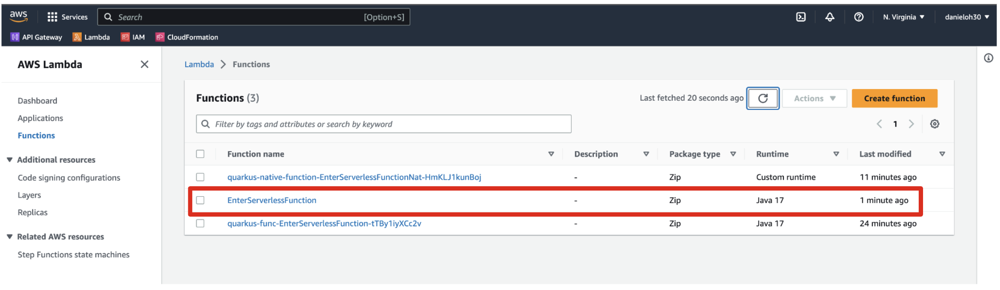

= 4. Optimize the function and make it portable using Quarkus Funqy

Add a Quarkus Funqy extension for Amazon Lambda deployment(_quarkus-funqy-amazon-lambda_) and remove the _quarkus-amazon-lambda-http_ extension:

[source,sh]
----
quarkus ext add quarkus-funqy-amazon-lambda

quarkus ext remove quarkus-amazon-lambda-http
----

Update the `GreetingResource.java` file to use `@funq` annotation. Then, remove unnecessary packages and annotations(_@Path, @PathParam, @GET_).

[source,java]
----
package org.acme;

import javax.inject.Inject;
import io.quarkus.funqy.Funq;

public class GreetingResource {

    @Inject
    GreetingService greetingService;

    @Funq
    public String greeting(String name) {
        return greetingService.greeting(name);
    }

    @Funq
    public String hello() {
        return "Hello Serverless";
    }
}
----

Before you'll deploy the function to AWS Lambda, you need to specify a function name. Add the following key and value in `application.properties` file:

[source,yaml]
----
quarkus.funqy.export=greeting
----

Then, package the application once again using the following command:

[source,sh]
----
quarkus build --no-tests
----

Or run the following maven package command:

[source,sh]
----
./mvnw clean package -DskipTests
----

Now, you have a new bash script to make you easier to deploy the function to AWS Lambda without using HTTP Gateway API, S3, ARN:

* `manage.sh` - wrapper around aws lambda cli calls

Open and inspect `manage.sh` file in the _target_ directory.

You don't need to use the _SAM CLI_ directly since *manage.sh* script is a wrapper to create and delete a function simply.

Run the script file with _LAMBDA_ROLE_ARN_ resource. If you have no IAM roles, you need to create a new one in the AWS console. Find more information https://docs.aws.amazon.com/IAM/latest/UserGuide/id_roles_create.html[here^].

[source,sh]
----
LAMBDA_ROLE_ARN=<YOUR_OWN_ARN> sh target/manage.sh create
----

The output should look like:

[source,sh]
----
{
    "FunctionName": "EnterServerlessFunction",
    "FunctionArn": "arn:aws:lambda:us-east-1:716861016243:function:EnterServerlessFunction",
    "Runtime": "java11",
    "Role": "arn:aws:iam::716861016243:role/lambda-role",
    "Handler": "io.quarkus.funqy.lambda.FunqyStreamHandler::handleRequest",
    "CodeSize": 14132884,
    "Description": "",
    "Timeout": 15,
    "MemorySize": 256,
    "LastModified": "2022-06-17T20:24:20.759+0000",
    "CodeSha256": "5QiygSRg3ZJacTVI4sFG2IPpqmx70gUinJK+RsbyS3E=",
    "Version": "$LATEST",
    "TracingConfig": {
        "Mode": "PassThrough"
    },
    "RevisionId": "61663da8-947f-460b-b94e-82365b19ab63",
    "State": "Pending",
    "StateReason": "The function is being created.",
    "StateReasonCode": "Creating",
    "PackageType": "Zip",
    "Architectures": [
        "x86_64"
    ],
    "EphemeralStorage": {
        "Size": 512
    }
}
----

[NOTE]
====
You probably see _"State": "Pending"_ in the result then go back to AWS web console to check if a new function is created or not.
====

Press `q` to exit from the output terminal.

Go back to Amazon web console then validate a new function(`EnterServerlessFunctions`):

Click the function name(`EnterServerlessFunctions`) then select `Test` menu. Input `"Funqy"` in the text area and `greeting` in Name field:

image::../images/aws-test.png[aws-test]

Click on `Test` button. Then, you will see the result as below. Click on `Details` to collapse the test details. 

If the function is not required to run on AWS Lambda, remove it using the following command:

[source,sh]
----
LAMBDA_ROLE_ARN=<YOUR_OWN_ARN> sh target/manage.sh delete
----

You can also remove the other HTTP gateway API functions using the following command:

[source,sh]
----
sam delete --stack-name quarkus-native-function
----

If you want to deploy the Quarkus Funqy application as a native executables, you need to package a native executable first using `./mvnw clean package -Pnative` then run the wrapper script using `LAMBDA_ROLE_ARN=<YOUR_OWN_ARN> sh target/manage.sh native create`.

➡️ Next section: link:./5-deploy-quarkus-functions.adoc[Deploy the function to Red Hat OpenShift Serverless]

⬅️ Previous section: link:./3-deploy-aws-lambda.adoc[Deploy to AWS Lambda with HTTP API]