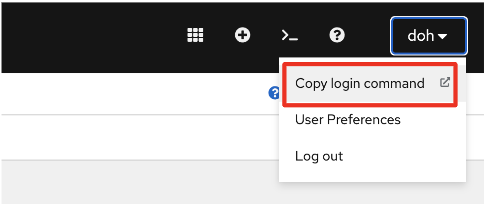
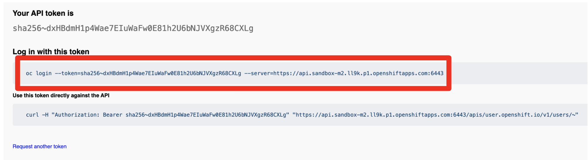
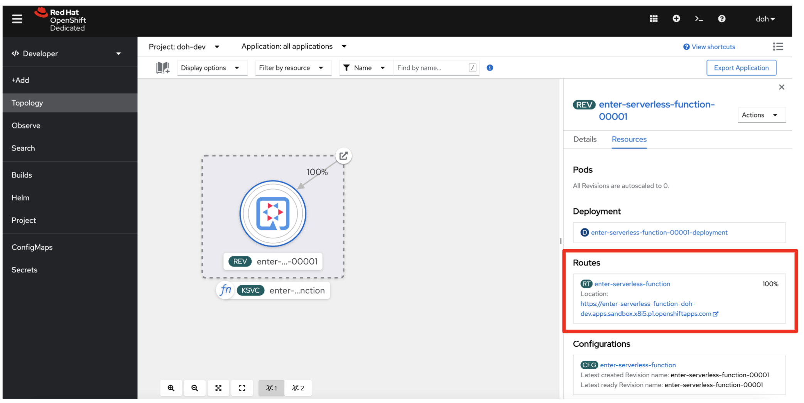
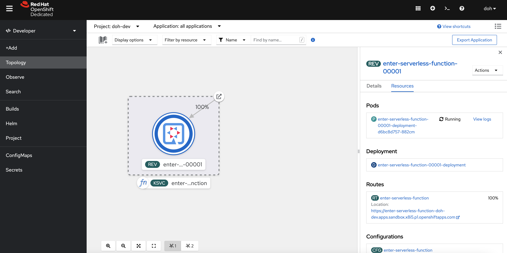

= 5. Deploy the function to Red Hat OpenShift Serverless

You'll use the https://developers.redhat.com/developer-sandbox[Developer Sandbox^] to deploy a Quarkus function. The sandbox allows developers to access Red Hat’s products and technologies without setup or configuration, and start developing quicker than ever before with our new sandbox environments for Red Hat OpenShift and CodeReady Workspaces. Try your hand at the technologies with our library of activities as well. You need to sign up the https://developers.redhat.com/developer-sandbox/get-started[Red Hat Developer Program^] first to provision a free sandbox. It will take less than 5 min from sign up to create a new cluster along the way.

Add an OpenShift and Knative Funqy extensions then remove an existing AWS extension:

[source,sh]
----
quarkus ext add quarkus-funqy-knative-events quarkus-openshift

quarkus ext remove quarkus-funqy-amazon-lambda
----

Update the `application.properties` for OpenShift Serverless deployment:

[NOTE]
====
Replace `username` with your own account in the developer sandbox.
====

[source,yaml]
----
kubernetes.deployment.target=knative
quarkus.container-image.group=username-dev
quarkus.container-image.registry=image-registry.openshift-image-registry.svc:5000
quarkus.kubernetes-client.trust-certs=true
quarkus.kubernetes.deploy=true
quarkus.openshift.build-strategy=docker
----

[NOTE]
====
If you want to use your own OpenShift cluster, you need to install _OpenShift Serverless Operator_ and _Knative-Serving_. Find more information https://docs.openshift.com/container-platform/4.8/serverless/admin_guide/install-serverless-operator.html[here^].
====

Make sure to log in the Developer Sandbox:

Click on `DevSandbox` then click on `Display Token`. It will show *Log in with this token*.

Copy the `oc login` command then paste it in your working terminal.

Run the following Maven command to deploy the function to OpenShift Serverless:

[source,sh]
----
quarkus build --no-tests
----

Or run the following maven package command:

[source,sh]
----
./mvnw clean package -DskipTests
----

The output will end with `BUILD SUCCESS`. You can overwrite the pod label to show the Quarkus icon by running the following https://docs.openshift.com/container-platform/4.9/cli_reference/openshift_cli/getting-started-cli.html[oc^] command:

[source,sh]
----
oc label rev/enter-serverless-function-00001 app.openshift.io/runtime=quarkus --overwrite
----

If you deployed the function multiple times, the revision number (e.g. _00001_) should be different.

Add the **function** icon to the Knative service by running the following oc command:

[source,sh]
----
oc label ksvc/enter-serverless-function boson.dev/function=true --overwrite
----

Go to the `Topology` view in _OpenShift Developer console_:

You might see the pod is already **terminated** since the scale-down-to-zero is `30` seconds by default in Knative Serving.

Copy the `Route URL` in Resource tab menu then invoke the function using HTTPie:

[source,sh]
----
echo '"Daniel Oh"' | http https://enter-serverless-function-doh-dev.apps.sandbox-m2.ll9k.p1.openshiftapps.com
----

The output should look like:

[source,sh]
----
HTTP/1.1 200 OK
content-length: 52
content-type: application/json
date: Mon, 15 Aug 2022 17:53:33 GMT
server: envoy
set-cookie: f301134c73b56fb5a7c418e831b3c2ee=a4a6175a464d76be57ebe4bdabb3decd; path=/; HttpOnly
x-envoy-upstream-service-time: 23

"Enter Serverless Functions with Quarkus, Daniel Oh"
----

When you got back to the Topology view, you will see the Quarkus pod is automatically scaled up in a second:

[NOTE]
====
When you deploy a native executable, the build will take more than 5 mins to finish. You might also have an out of memory error. To fix it, make sure to set `Dquarkus.native.native-image-xmx=4g`.
====

➡️ link:./6-generate-kn-functions.adoc[6. Generate a new function project using Kn func CLI]

⬅️ link:./4-optimize-quarkus-functions.adoc[4. Optimize the function and make it portable using Quarkus Funqy]