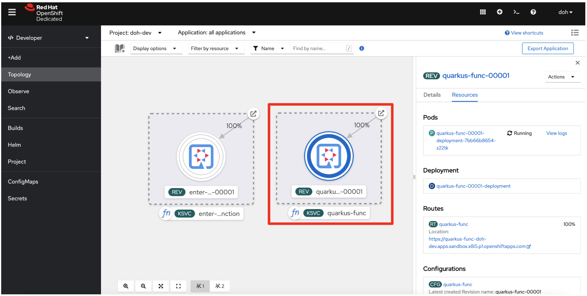
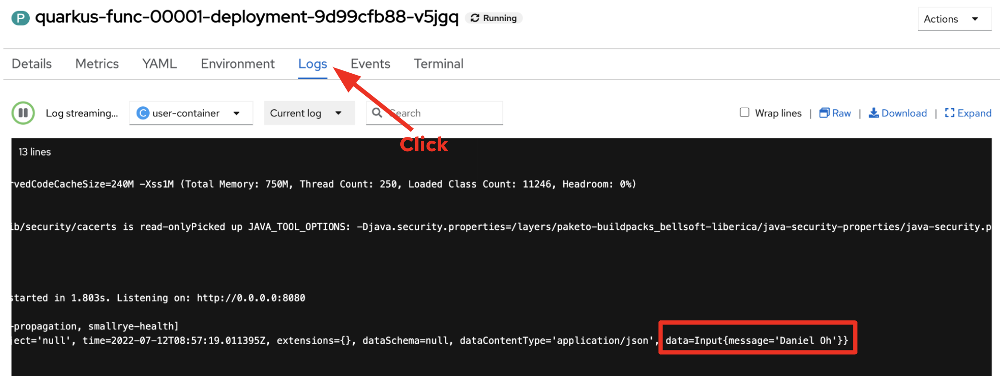

= 6. Generate a new function project using Kn func CLI

[NOTE]
====
Red Hat OpenShift Serverless Function is still a Tech Preview feature. If you haven't installed Knative command (kn) yet, find more information https://docs.openshift.com/container-platform/4.10/serverless/cli_tools/advanced-kn-config.html[here^].
====

Run the following command:

[source,sh]
----
cd ..
kn func create quarkus-func -l quarkus -t cloudevents
----

The output should look like:

[source,sh]
----
Created quarkus Function in /serverless-workshop/quarkus-func
----

Inspect the new function project such as `func.yaml` and `Function.java`.

Deploy the function directly to Red Hat OpenShift. Make sure to change the directory where the _func.yaml_ exists:

Replace `YOUR_USERNAME` with your own account in the developer sandbox. You also need to replace `YOUR_CONTAINER_REGISTRY` with an external container registry that you want to push the image. For example, *quay.io/danieloh30*

[source,sh]
----
cd quarkus-func
kn func deploy -r YOUR_CONTAINER_REGISTRY -n YOUR_USERNAME-dev -v
----

Kn func uses https://buildpacks.io[Buildpack^] tool to build a function and deploy it to Kubernetes or OpenShift. Once the build is completed, you will see the output like:

[source,sh]
----
Waiting for Knative Service to become ready
Function deployed at URL: https://quarkus-func-doh-dev.apps.sandbox-m2.ll9k.p1.openshiftapps.com
----

Go back to the `Topology` view in the developer sandbox, you will see a new function deployed. You can also overwrite the Quarkus label by _oc_ command or OpenShift web console:

Send a new `cloudevent` message to the new function using Kn func emit:

[source,sh]
----
kn func invoke --content-type="application/json" --data="Daniel Oh" -f=cloudevent -t=YOUR_FUNCTION_URL
----

The output should look like:

[source,sh]
----
p1.openshiftapps.com
Context Attributes,
  specversion: 1.0
  type: function.output
  source: function
  id: ceb3f86a-bc4c-49db-8a82-d69b1ed81aab
  datacontenttype: application/json
Data,
  {
    "message": "Daniel Oh"
  }
----

When you go to the pod logs in OpenShift console, you will see the same cloudevent message output:

=== Congratulations!

➡️ Next section: link:./7-summary.adoc[Summary]

⬅️ Previous section: link:./5-deploy-quarkus-functions.adoc[Deploy the function to Red Hat OpenShift Serverless]