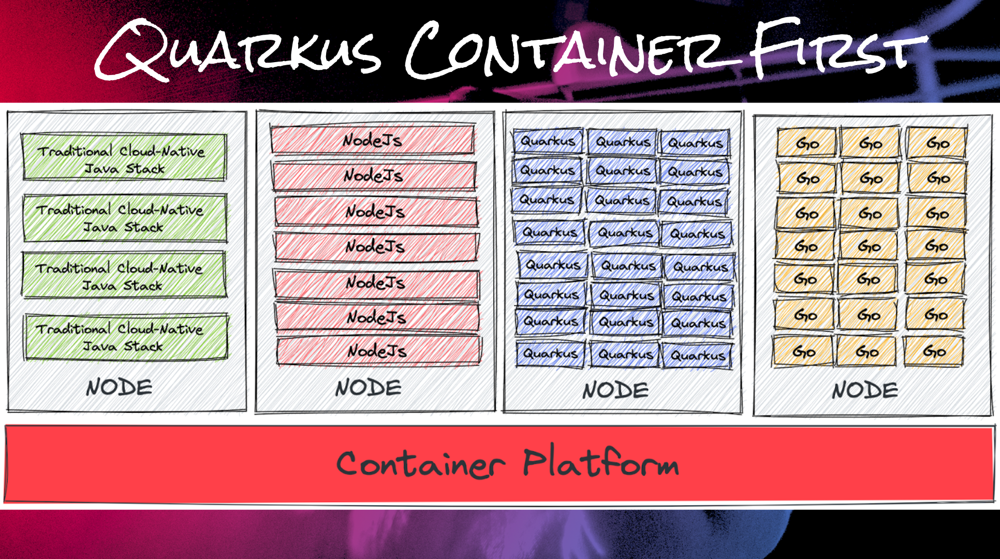
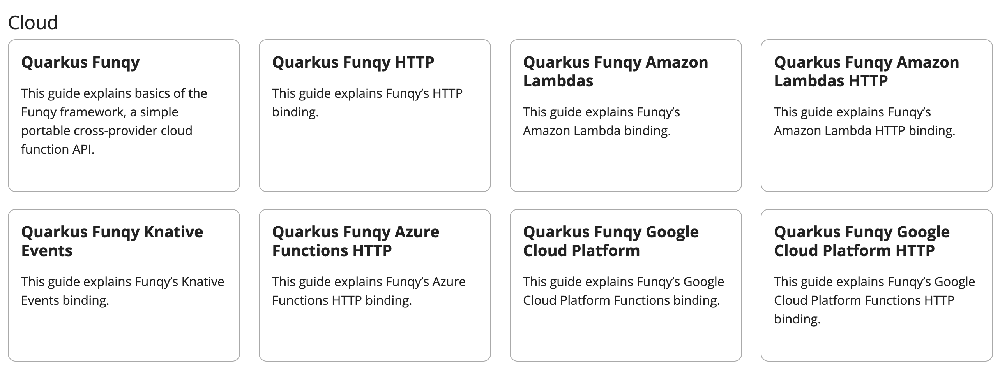

= Summary

You've learned today how quickly Java developers can create cloud-native microservice project using [Quarkus](https://quarkus.io/). Then, the applications were deployed to serverless functions to [AWS Lambda](https://aws.amazon.com/lambda/) and [Kubernetes](https://kubernetes.io/) [Knative](https://knative.dev/docs/) with `JVM` and `Native` mode with the key benefits of Quarkus as below:

* Move as much as possible to build phase
* Minimize runtime dependencies
* Maximize dead code elimination
* Introduce clear metadata contracts
* Enhance developer joy

The Quarkus native compilation allows you to have high resource density as almost same as https://go.dev[Go programming language^] on the Kubernetes clusters.

Quarkus funqy also provides the other extensions for you to deploy the serverless functions to` Azure Function` and `Google Cloud Platform`.

== Additional Resources

=== eBook and Blogs

* https://opensource.com/downloads/java-serverless-ebook[A guide to Java serverless functions^]
* https://dzone.com/refcardz/getting-started-with-quarkus-serverless-functions[Getting Started with Quarkus Serverless Functions^]
* https://www.infoq.com/articles/reduce-CO2-with-serveless[Reduce Carbon Dioxide Emissions with Serverless and Kubernetes Native Java^]
* https://youtu.be/W2QPxfEU_bw[Video - Build your first Java Serverless Function using Quarkus Quick start^]

=== Tutorial Videos

* https://youtu.be/fQFVwoXWRto[Quarkus Funqy OpenShift Serverless^]
* https://youtu.be/BOvxdY8cSHw[Deploying Quarkus based Amazon Lambdas^]
* https://youtu.be/3LtTQml7Gv8[Make Quarkus Serverless from Devfiles to OpenShift^]
* https://youtu.be/zYSQdX-tVsE[Microsweeper Demo with Quarkus on Azure Red Hat OpenShift^]
* https://youtu.be/UBDzHnDjc_g[Microsweeper Demo with Quarkus on Red Hat OpenShift Service on AWS^]